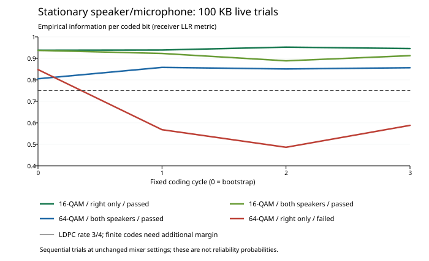

# Acoustic routing and 16/64-QAM reception diagnosis

On 2026-09-21 the user reported that 64-QAM reception failed while 16-QAM
worked, and that mono transmission looked better in the constellation plot.
Four real default-device transfers reproduced a 64-QAM failure. Both 16-QAM
routes succeeded. The failure reached the LDPC decoder: acquisition, pilot
admission, interval delivery, and physical completion continued normally.

The practical default selected from this comparison is **16-QAM, LDPC 3/4,
depth 8, right-only output**. A longer 500,000-byte live transfer also passed
exactly in 140.497 seconds, with all 96 LDPC frames converging. The 64-QAM
setting remains useful as an
explicit higher-throughput option; this study does not establish its reliability
in other room conditions. No 50 MB success probability is established here.

## Live comparison

Playback volume was 95% and microphone volume 27%; the user reported stationary
speaker/microphone geometry. Tests used 48 kHz PCM, FFT 32768, prefix 4096
samples, pilot stride 16, 500–18000 Hz, amplitude 0.40, LDPC 3/4, and depth 8.
Each transmitted the same deterministic 100,000-byte source, seed 701. The
source SHA-256 was
`c7d21f41c0c428c0a55126f3103fd48c45f41c358a4b65a6ca5e183e92731f2b`.
Successful received files matched it exactly.

| QAM | Output route | Exact result | Wall time | LDPC frames converged / attempted | Iterations | Received signal RMS |
| --- | --- | --- | ---: | ---: | ---: | ---: |
| 64 | Both speakers | Pass | 48.338 s | 32 / 32 | 181 | −22.61 dBFS |
| 64 | Right only | Fail | 48.337 s | 8 / 16 | 439 | −26.09 dBFS |
| 16 | Right only | Pass | 60.634 s | 32 / 32 | 70 | −26.10 dBFS |
| 16 | Both speakers | Pass | 60.629 s | 32 / 32 | 89 | −22.56 dBFS |

“Mono” means **right-only playback** when the audio endpoint has two output
channels: the left output is silent. Stereo sends the same waveform to both
speakers. It does not send different modem data on the two channels. Capture
continues to use the application's mono input stream.

Stereo produced approximately **3.5 dB more received signal RMS** in this
setup. These are therefore route comparisons at the same software amplitude,
not comparisons at matched received power. They do not isolate two-speaker
interference, loudspeaker distortion, or room response as a single cause.
No samples in the reported signal windows digitally clipped. That observation
does not measure distortion inside the loudspeakers or analog hardware.

All four recordings delivered 1016 of 1016 physical intervals with no capture
FIFO overflow or reported audio exception. In the failed case the bootstrap's
eight LDPC frames converged; all eight frames of the next coding cycle failed.
The source decoder stopped after that failure, although physical reception
continued. Exact-bit offline diagnostics therefore cover 32 transmitted frames,
including the later cycles that the failed source decoder did not attempt.

Two additional 64-QAM/right-only transfers also failed. Repeating amplitude
0.40 failed all eight bootstrap frames. Reducing amplitude to 0.20 allowed
the bootstrap to decode, but all eight frames of the next cycle failed.
Both still received all 1016 physical intervals without FIFO overflow or
reported digital clipping. Lowering the level alone did not restore a complete
transfer; this does not rule out analog distortion as one contributor.

## Information margin rather than plot appearance

Known transmitted bits were compared with the receiver's actual equalized
symbols and clipped max-log LLRs. The information figure is empirical
generalized mutual information (GMI) at the decoder's existing LLR scale:

`1 − mean(log2(1 + exp(−signed LLR)))` per coded bit.

The frame, cycle, and bit-plane figures exclude the 1792 fixed alignment bits
outside the eight 64800-bit LDPC frames in each coding cycle. Every frame in
this comparison has all 64800 coordinates represented; none was erased.

| QAM / route | Cycle 0 GMI/bit | Cycle 1 | Cycle 2 | Cycle 3 | Lowest frame GMI/bit | Hard BER |
| --- | ---: | ---: | ---: | ---: | ---: | ---: |
| 64 / both | 0.8050 | 0.8579 | 0.8506 | 0.8563 | 0.8038 | 4.72% |
| 64 / right | 0.8477 | 0.5680 | 0.4862 | 0.5882 | 0.4825 | 12.43% |
| 16 / right | 0.9377 | 0.9387 | 0.9522 | 0.9456 | 0.9365 | 1.58% |
| 16 / both | 0.9370 | 0.9227 | 0.8884 | 0.9125 | 0.8869 | 2.43% |

| Follow-up 64-QAM/right-only run | Cycle 0 GMI/bit | Cycle 1 | Cycle 2 | Cycle 3 | Lowest frame GMI/bit |
| --- | ---: | ---: | ---: | ---: | ---: |
| Repeat, amplitude 0.40 | 0.5957 | 0.5975 | 0.6895 | 0.7519 | 0.5943 |
| Reduced amplitude 0.20 | 0.7835 | 0.7668 | 0.8229 | 0.8147 | 0.7647 |

Rate 3/4 carries 0.75 information bits per coded bit, corresponding to 4.5
bits per 64-QAM data tone or 3 bits per 16-QAM data tone. Comparing that load
with empirical GMI is a useful engineering margin diagnostic for these
demodulator metrics. GMI is not a strict channel-capacity upper bound, and a
sub-rate value does not prove that every alternative decoder must fail.
Finite LDPC frames need additional margin; exceeding 0.75 is not a success
guarantee. The degraded 64-QAM/right-only cycles also fall below a 2/3-code
load in this comparison, so these observations do not support choosing 2/3
at amplitude 0.40 as a sufficient remedy. This is a diagnostic comparison,
not an actual transmission using that 2/3 setting.
The reduced-amplitude run illustrates the finite-code caveat directly: its
failed cycle exceeded 0.75 GMI/bit, but did not provide enough margin for the
actual rate-3/4 LDPC decoder.

A post-capture scan of common LLR scales barely changed the worst failed
cycle's GMI, from 0.4862 to 0.4880. Confidence rescaling alone cannot recover
the lost margin. This scan uses known transmitted bits and is an oracle
diagnostic, not an implemented receiver improvement or a Shannon-capacity
measurement.

At equal average symbol power, 64-QAM's minimum point spacing is about 2.05
times smaller than 16-QAM's, a 6.23 dB difference in squared spacing. Dense
constellations expose channel-estimation errors that a 16-QAM decoder can
tolerate.

The previous constellation display retained the latest 512 points from a
frequency-ordered OFDM block. It typically represented only the upper part of
the band, and a partial final block represented a different slice. Its axes
also expanded to include outliers. Those plots were insufficient to compare
whole-channel margin. The accompanying telemetry change samples across the
publication batch and distinguishes retained points from new observations.
The displayed nearest-decision EVM also differs from the exact-known-symbol
error used by these diagnostics.

## What changed during the failed recording

The first 64-QAM/right-only coding cycle had strong margin. The next cycle
collapsed after a full-band refresh. That timing initially suggested a bad
refresh update; controlled replay did not support that explanation by itself.
The baseline combines 75% of the preceding channel estimate, aligned to the
current common gain, with 25% of the new known refresh observation.

| Channel update during replay | Cycle 0 GMI/bit | Cycle 1 | Cycle 2 | Cycle 3 | Exact source |
| --- | ---: | ---: | ---: | ---: | --- |
| Baseline 75/25 blend | 0.8477 | 0.5680 | 0.4862 | 0.5882 | No |
| Freeze startup channel estimate | 0.8477 | 0.5597 | 0.4182 | 0.4248 | No |
| Replace with latest refresh | 0.8477 | 0.5120 | 0.5310 | 0.8380 | No |

Freezing the estimate made the later cycles worse. Using the latest refresh
restored the last cycle but did not repair the intervening failure. Neither
experimental update was retained. Global timing corrections remained below
about 0.05 sample and the final clock estimate was approximately 0.046 ppm;
the timing search's six-sample radius was not approached.

A separate diagnostic fitted a per-frequency complex correction using the
even-numbered data blocks within each cycle and scored its predictions on the
unseen odd-numbered blocks. This uses known source data unavailable to the
ordinary receiver and makes no claim that the proposed correction can be
estimated online. Errors were also weighted back into received-bin units so
that deep equalizer fades did not dominate the conclusion.

| Failed recording cycle | Existing prediction error / reference signal | With independently fitted correction |
| --- | ---: | ---: |
| 0 | −18.46 dB | −18.50 dB |
| 1 | −11.42 dB | −11.83 dB |
| 2 | −9.30 dB | −19.87 dB |
| 3 | −11.87 dB | −21.58 dB |

Cycle 1 could not be described well by one frequency response across the
cycle; transient noise or a varying response remained. In cycles 2 and 3,
the large improvement on held-out blocks demonstrates a persistent
frequency-dependent prediction error. It is more specific evidence than the
constellation cloud alone. These observations do not uniquely identify an
acoustic movement, device processing, loudspeaker behavior, or a remaining
receiver-estimation limitation. Stationary user geometry does not establish
that every part of the acoustic and electronic path was time-invariant.

## Practical decision and remaining limits

The 16-QAM/right-only setting has substantial measured margin in this
comparison, agrees with the user's successful setting, and keeps the same
LDPC, compact source framing, approximately 0.3% RS, and physical-completion
rules. Its steady source rate is approximately 38.8 kbit/s with the current
fixed geometry. The 64-QAM setting is approximately 56.0 kbit/s. Short-file
wall times also include training, coding-cycle padding, and end silence.

The longer right-only 16-QAM confirmation transferred **500,000 bytes** in
140.497 seconds wall time, including 131.328 seconds of waveform and an
eight-second tail. All 96 LDPC frames converged in 254 total iterations;
3048 of 3048 intervals arrived, with no FIFO overflow. Source and received
SHA-256 values matched:
`d706ba74cd851fd10bf5ea1e91da48760f13cf86314bff66595e1b75e271c849`.
This is a completed transfer, not a projection.

These few sequential trials do not measure an
80% success probability for 50 MB, and they do not establish an acoustic
Shannon limit. Faster tracking of a frequency-dependent response remains a
useful development direction; the failed-cycle evidence is insufficient to
select an untested tracking algorithm as a production fix.

The reduced-amplitude recording motivated a further live experiment:
64-QAM, amplitude 0.20, and LDPC 2/3, which would provide approximately
49.8 kbit/s steady source rate. That new transmission also failed all eight
bootstrap frames, despite uninterrupted interval reception. It was not
selected as the default. A promising information margin measured during one
recording was insufficient to qualify a later transmission with stronger
coding; contemporaneous channel conditions and estimator behavior matter.
The actual rate-2/3 recording measured cycle GMI values of 0.6785, 0.7011,
0.7395, and 0.7610 per coded bit. Its bootstrap had only about 0.012 above
the nominal 2/3 load, and its weakest frame measured 0.6761. That narrow
empirical margin did not suffice for the finite LDPC decoder. This does not
show that rate 2/3 is intrinsically less capable than rate 3/4; the two live
recordings had different measured information margins.

These tests do not measure the current channel's Shannon capacity. Doing so
would require a stated power constraint and contemporaneous frequency-dependent
signal/noise characterization, including its variation with time. The earlier
room sounder's conditional capacity estimate cannot be treated as a fixed
capacity for these later recordings. Practical routes toward higher throughput
include more responsive frequency-dependent estimation, pilot designs that
support it, and coding/modulation chosen with measured margin. The oracle
prediction experiment demonstrates that some later-cycle error is potentially
recoverable through better estimation, but supplies neither an online estimator
nor a guaranteed rate improvement.

## Application validation

After selecting 16-QAM/right-only as the acoustic default, the shared GUI
transmit, listen, completion, and Save path transferred a 60-byte text over
the real default speakers/microphone in **41.456 seconds**. Both processes
exited successfully; the listener delivered 508 intervals, observed physical
completion, and saved the exact 60 bytes. This exercises the shared GUI
application behavior with real audio, not native window-rendering conformance.

The focused regression run passed **20/20 tests in 142.80 seconds**, including
the default/profile, CLI, telemetry, and shared GUI coverage selected for
these changes. Compact logs and the live GUI harness are included in the
evidence archive. Experimental frozen/full-refresh controls were removed;
the production channel estimator retains its independently admitted 75/25
refresh update.
Both Release GUI targets built successfully, and the Rev headless toolkit
self-check passed. These checks do not substitute for native visual inspection.

Compact results, source snapshots, hashes, and reproduction instructions are
in [the evidence archive](validation-data/fast/acoustic-routing-20260921/README.md).
Raw audio is retained outside the repository.
