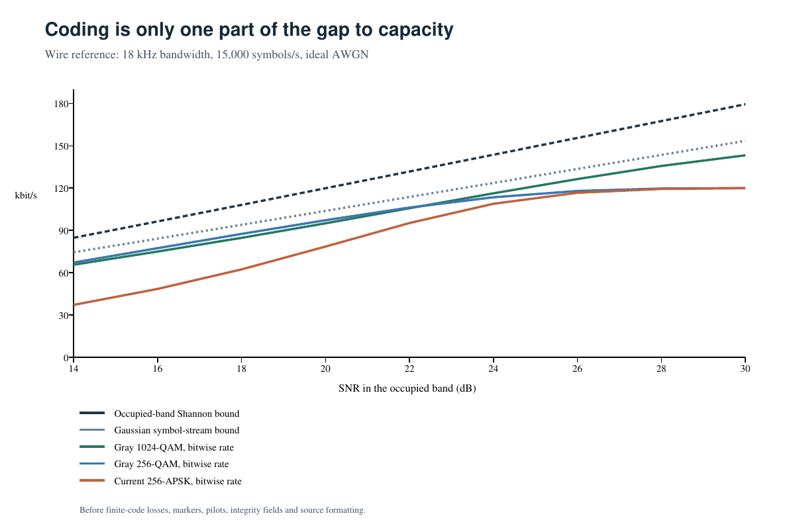

# Fast coding study: approaching channel capacity

Date: 2026-09-19. This is an offline engineering study, not a new wire format.
The production modem, saved defaults, independent wire vectors, short-message
paths and physical-completion behavior are unchanged.

## Objective and scope

Maximize successful payload throughput for 100 KB and 5 MB files at a given
bandwidth and noise level. Occasional file failure is acceptable. Treat roughly
0.3% long-span outer protection as an aggressive interruption budget, with
additional parity justified by its contribution to throughput. More decoding
computation is acceptable. Compare wire, radio audio and speaker/microphone
profiles, rather than assuming one code rate is optimal everywhere.

There is no single optimum pair of LDPC and RS rates independent of SNR,
modulation, bit mapping, block length and the channel. Increasing block length
and allowing unbounded latency also changes the optimization problem. The
results below identify practical candidates and measured limitations, not a
proof of global optimality over all codes.

## Capacity definitions

For a flat AWGN channel with average signal power P and noise power N in the
occupied bandwidth B, the Shannon upper bound is `B log2(1 + P/N)`. The current
profiles use symbol rate Rs and 20% pulse-shaping rolloff, so `B = 1.2 Rs`.
The corresponding normalized symbol energy is `Es/N0 = 1.2 P/N`.

These bounds must be kept separate:

1. **Occupied-band Shannon bound:** arbitrary permitted signals across B.
2. **Current symbol-stream Gaussian-input bound:**
   `Rs log2(1 + Es/N0)`, before finite constellations or protocol overhead.
3. **Constellation mutual information (CM):** the achievable information rate
   for the actual uniformly distributed symbols and an optimal symbol decoder.
4. **Bitwise generalized mutual information (GMI):** the corresponding rate
   available to the binary soft decoder and its bit labeling.
5. **Measured finite-code throughput:** includes LDPC failures, outer repair,
   waveform overhead, source layout, padding and the physical end.

The Monte Carlo GMI method follows
[Alvarado et al., equations 27 and 34–36](https://arxiv.org/pdf/1709.10393).
Exact matched likelihoods use scale one. The max-log column searches a finite
positive scale grid and is an approximate achievable-rate estimate, not an
exact continuous optimization. Monte Carlo standard errors are included.

| Profile | Symbols/s | Occupied bandwidth | Shannon bound at 20 dB | At 30 dB |
|---|---:|---:|---:|---:|
| Wire | 15,000 | 18,000 Hz | 119.85 kbit/s | 179.41 kbit/s |
| SSB/FM audio | 2,000 | 2,400 Hz | 15.98 kbit/s | 23.92 kbit/s |
| Acoustic | 500 | 600 Hz | 4.00 kbit/s | 5.98 kbit/s |

These are AWGN reference values. Acoustic multipath and radio fading,
nonlinearity or colored noise require a measured channel model; the flat AWGN
formula is not their established capacity.

## Constellation and mapping results

`tools/fast_capacity.cpp` uses the production APSK coordinates and labels,
and independently constructs conventional Gray square QAM for comparison.
It uses unit mean symbol energy, complex Gaussian noise, perfect timing and
known noise variance. There are 30,000 independent symbol observations per
point, with deterministic seeds. This is not sampled PCM receiver performance.

| Mapping | GMI at 20 dB in-band SNR | GMI at 30 dB |
|---|---:|---:|
| Current 64-APSK | 5.827 bits/symbol | 6.000 |
| Current 256-APSK | 5.232 | 7.996 |
| Gray 256-QAM | 6.479 | 7.999 |
| Gray 1024-QAM | 6.332 | 9.547 |

The independent NumPy cross-check used 200,000 observations at 20 dB and
obtained **5.246 ± 0.0076** for current 256-APSK and **6.492 ± 0.0032** for
Gray 256-QAM (one standard error). The approximately **24%** difference is
an information-rate gain before selecting any finite code. The current
256-APSK CM value at 20 dB is 6.526, showing that the labels and bitwise
decoding lose substantial information beyond the constellation geometry.

At 30 dB, the occupied-band Shannon bound for wire is 179.41 kbit/s, while
the symbol-stream Gaussian bound is about 153.45 kbit/s. Even uncoded
256-point signaling is limited to 120 kbit/s before markers and pilots.
Consequently changing FEC alone cannot bring the existing waveform close to
the occupied-band bound at high SNR.

Raw results: [capacity.csv](validation-data/fast/coding-study-20260919/capacity.csv),
[independent cross-check](validation-data/fast/coding-study-20260919/gmi-crosscheck.csv).



## Finite LDPC experiment

The standalone diagnostic uses the 0BSD
[xdsopl/LDPC implementation](https://github.com/xdsopl/LDPC), pinned at
`32357d8ad55a6a302c34e093759f0454e45cca56`. The tested normal DVB-S2 codes have
64,800 coded bits and rates 3/4, 4/5, 5/6, 8/9 and 9/10. A finer search adds
DVB-S2X table B10, `(N,K)=(64800,50400)`, rate **7/9**. The decoder is
double-precision layered log-domain sum-product, capped at 100 iterations.
A seeded full-word permutation distributes code bits across symbol bit
positions; it is not a jointly optimized LDPC/bit mapping.

Every decoded bit is compared with the original, including codewords whose
parity checks pass. Tests use exact log-sum likelihoods, known N0 and perfect
symbol timing. There is **no BCH, RS, PCM front end, encryption, source-cell
encoding, burst interruption or protocol framing in this experiment**.
Reported rates are information bits at the LDPC input. Decoder CPU timings
were collected alongside concurrent work and are not isolated benchmarks.

An initial example at 20 dB in-band SNR: Gray 256-QAM with rate 3/4 recovered
32/32 words, while rate 4/5 recovered 0/32. At 25 dB, Gray 1024-QAM with
rate 3/4 recovered 32/32 words and carries 7.5 input bits/symbol, exceeding
256-QAM at rate 9/10 (7.2 bits/symbol) by **4.17%**. Rate 4/5 with 1024-QAM
failed all 16 words tested at that point. These are examples of why
constellation and code rate must be optimized jointly.

The best tested points after the finer search are:

| In-band SNR | Gray square QAM | LDPC rate | Input bits/symbol | Extended result | Wire input rate |
|---|---:|---:|---:|---:|---:|
| 20 dB | 256 | 7/9 | 6.2222 | 800/800 correct | 93.333 kbit/s |
| 25 dB | 1024 | 7/9 | 7.7778 | 800/800 correct | 116.667 kbit/s |
| 30 dB | 4096 | 7/9 | 9.3333 | 800/800 correct | 140.000 kbit/s |

Each extension decoded **5,040,000 random information bytes** with zero wrong
decoded bits, syndrome failures or undetected wrong words. Relative to the
coarser winners (256-QAM/3/4, 1024-QAM/3/4, 1024-QAM/9/10), throughput rises
**3.70%**. The tested 4/5 matrix failed 32/32, 16/16 and 16/16 words at these
respective modulation/SNR points. More matrices and rates might do better;
these are bounded-search winners, not universal code optima.

These input rates are about **78% of occupied-band Gaussian capacity**, before
waveform and file overhead. They should not be described as 0.69 dB from Shannon.
With eight integrity bytes inside each word, 5,000,000 source bytes, 795 source
shards, three repair shards and final-word padding, the corresponding modeled
wire source rates are **92.825, 116.031 and 139.237 kbit/s**. Those still exclude
markers, pilots, source formatting, acquisition and physical-end silence, and
assume the outer code succeeds. The outer RS encoder was not implemented here.

For rate-9/10, the successful sampled 256-APSK point was Es/N0=25.4 dB
(128/128 words), versus 24.1 dB for Gray 256-QAM (688/688). This **1.3 dB**
difference is between tested successful points with unequal trial counts,
not an equal-FER threshold or a measured coding gain.

Final candidates averaged 12.9–14.2 iterations and 245–264 ms of decoding per
word on a Ryzen 5 PRO 5650U under concurrent load. Exact separable QAM demapping
added 8–17 ms. This demonstrates computational feasibility at the proposed
symbol rates in this idealized experiment, not a complete real-time modem test.

Evidence: [all LDPC trials](validation-data/fast/coding-study-20260919/ldpc-all.csv),
[final candidates](validation-data/fast/coding-study-20260919/ldpc-candidates.csv),
[method and reproduction](validation-data/fast/coding-study-20260919/ldpc-method.md).

Zero failures in a short run are not a zero error rate. For zero failures in
F trials the one-sided 95% upper bound is `1 - 0.05^(1/F)`. Establishing an
upper bound below 0.03% requires approximately 10,000 independent successful
words at one fixed operating point. These experiments locate useful operating
points; they do not certify such a small FER for every channel. Specifically,
0/800 failures gives a one-sided 95% FER upper bound of **0.374%**, not 0.03%.

## Results for the three physical profiles

An additional audit sends 64 random physical intervals, 131,072 payload bits,
through the production sampled PCM transmitter and receiver at each of 32
points. All points acquired, retained the correct 64 interval identities and
reached the receiver's observed-absence completion event. Every clean baseline
was bit-exact. Unlike the LDPC experiment above, this audit includes existing
pulse shaping, markers, pilots, acquisition, tracking, equalization and soft
erasures. It measures empirical bit-metric information, **not LDPC decoding**.

| Channel and SNR | Best current constellation by framed metric | Bit metric per payload symbol | Framed metric rate | Next larger constellation's framed rate |
|---|---:|---:|---:|---:|
| Wire AWGN, 20 dB | 64-APSK | 5.743 / 6 | 65.35 kbit/s | 256: 49.05 kbit/s |
| Wire AWGN, 30 dB | 256-APSK | 7.987 / 8 | 87.13 kbit/s | — |
| SSB/FM audio AWGN, 20 dB | 64-APSK | 5.745 / 6 | 8.716 kbit/s | 256: 6.692 kbit/s |
| SSB/FM audio AWGN, 30 dB | 256-APSK | 7.987 / 8 | 11.618 kbit/s | — |
| Acoustic echo, 20 dB | 16-APSK | 3.965 / 4 | 1.586 kbit/s | 64: 1.487 kbit/s |
| Acoustic echo, 30 dB | 64-APSK | 5.988 / 6 | 2.271 kbit/s | 256: 2.145 kbit/s |

These framed metric rates include current markers and pilots but exclude FEC,
source layout, integrity, initial/final fill and silence. They are empirical
information-rate comparisons, not promises of achievable file rates or rigorous
capacity bounds for a channel with memory.

**Wire:** prioritize Gray QAM, accurate soft likelihoods and the long 7/9 LDPC
baseline for a redesigned capacity-oriented mode. On the current APSK waveform,
64-APSK at 20 dB and 256-APSK at 30 dB have margin for high-rate LDPC; 8/9 and
9/10 are candidates requiring decoded PCM tests.

**Radio:** the same AWGN code family is appropriate for a linear audio link;
rates scale by 2,000/15,000. The current SSB and FM audio PHY is identical at
fixed constellation, so the table covers both audio presets. This does not
model RF fading, FM threshold, frequency error or transmitter compression.
Those effects can change the optimum constellation, interleaver and code.

**Speaker/microphone:** select modulation and equalization before maximizing
the LDPC rate. With the tested echo, prioritize 16-APSK with 8/9 or 9/10 at
20 dB, and 64-APSK with those rates at 30 dB. These code choices are candidates,
not measured LDPC/PCM successes. With AWGN alone at 20 dB, 64-APSK's normalized
metric is 0.9095, leaving almost no information margin for rate 9/10; compare
5/6 and 8/9 directly. Under the echo, 64-APSK at 20 dB drops to 0.6535, and
256-APSK at 30 dB to 0.7372. Larger constellations cannot be justified merely
by attaching stronger FEC to these measured soft decisions.

The acoustic echo is one static synthetic response from the existing fixtures:
`h[0]=0.6, h[216]=0.36, h[432]=0.12` at 48 kHz. SNR is normalized to the
clean **received** power after echo. It is not a measurement of a room or device.
The 64,800-bit inner word also spans 28.8 seconds at current acoustic 64-APSK
framing, versus 0.751 seconds at wire 256-APSK, when padded to 32 physical
intervals. A 16,200-bit code would approximately quarter
that latency but needs a separate throughput/error comparison.

Evidence: [sampled results](validation-data/fast/coding-study-20260919/sampled-channel.csv),
[method, normalization and limits](validation-data/fast/coding-study-20260919/sampled-channel-method.md).

## Outer Reed–Solomon selection

Use detected failed inner words as erasures. Near an LDPC waterfall, failed
words can contain hundreds of incorrect bits; a small code that corrects
one or two errors inside each word does not substitute for erasure repair.
Detection must use an integrity check as well as LDPC parity constraints.

For K source words, r RS repair words, and independent residual inner-word
failure probability q, including failed repair words:

```
P(file success) = P[Binomial(K + r, q) <= r]
relative goodput = K / (K + r) * P(file success)
```

Optimize r with the measured LDPC operating point, rather than first fixing
LDPC and choosing RS from an average bit error rate. Burst-correlated failures
require measured erasure patterns instead of this independence model.
`tools/fast_coding_analysis.py` performs the binomial optimization and reports
both observed FER and its one-sided confidence bound. It searches up to 10%
repair overhead and rounds the configured 0.3% minimum **up** to complete
repair words; it never calls three repair words per 688 source words 0.3%.

For the selected LDPC baseline, each information word contains 6,300 bytes.
Reserving eight bytes for a modeled integrity field leaves 6,292 source bytes;
a decimal 5 MB file therefore needs **K=795** source shards. The following
noise-only optimization rounds the requested 0.3% minimum up to three shards:

| Residual word FER | Noise-only throughput-optimal repairs | Parity/data |
|---|---:|---:|
| 0.01% | 3 | 0.377% |
| 0.03% | 3 | 0.377% |
| 0.1% | 4 | 0.503% |
| 0.3% | 8 | 1.006% |
| 1% | 17 | 2.138% |

At FER 0.1%, four repairs give modeled file success **99.861%**. At FER 0.3%,
eight repairs give **99.914%**. Thus approximately **0.4–1% outer parity** is a
useful operating range when the measured residual inner-word FER is at or below
0.3%. It is not an unconditional guarantee near an unspecified LDPC threshold.
These choices maximize expected successful source bytes per channel time;
they do not impose an arbitrary fixed file-success target. No interruption
probability was supplied, so an optimum including interruptions is undetermined.

For a **100,000-byte file**, the same inner geometry needs only 16 source
shards. Allowing zero outer parity, the model chooses **no RS** at residual
FER 0.1% or 0.3%. A single repair would cost 6.25%. It first improves expected
throughput over zero repairs when `q > 1/K²`, here **0.390625%**. At FER 1%,
one repair is optimal. This supports accepting occasional short-file retries
instead of rounding a nominal 0.3% budget up to an expensive whole repair shard.
The comparison excludes turnaround time and fixed startup/end overhead;
those make retries more expensive than the simple continuous-airtime model.

With r fixed, use systematic RS over **GF(2^16)** across corresponding
16-bit positions of LDPC-word-sized shards. This accommodates roughly 700–900
shards for a 5 MB source in one protection group; conventional GF(256) RS is
limited to 255 symbols. The initial candidate is **RS(798,795)**; at residual
FER 0.1% use **RS(799,795)**. These operate in each 16-bit stripe of the data
shards, not on a single 798-byte or 799-byte word. Repair shards receive their
own inner integrity fields. The shard layout, terminal shortening,
integrity checks and fixed local maximum geometry still require protocol design.
See [RFC 5510](https://www.rfc-editor.org/rfc/rfc5510.html).

The roughly 0.3% interruption allocation is shared with random erasures when
unused. If an interruption consumes it, extra failures need extra capacity.
Exactly two seconds per 600 seconds is 0.333%, and whole-word loss plus
reacquisition can enlarge the damaged span. Sparse parity cannot promise that
coverage independently of block size and interleaving.

For example, at 15,000 symbols/s with 4096-QAM a 64,800-bit word lasts
0.36 seconds before framing. If every word touched by a two-second dropout
is erased, up to **seven** words can be lost: already **0.88%** of 795 source
shards, before random errors. Three repair words alone do not cover that event.
This 5 MB example finishes in under five minutes before framing; the user's
choice to accept retransmission for shorter transfers can justify accepting
that risk. Interleaving can let LDPC recover partially damaged words, but
requires burst tests before assigning a smaller repair budget.

The [confidence-based RS model](validation-data/fast/coding-study-20260919/rs-model.csv)
also optimizes at the statistical upper FER bound rather than pretending the
observed zero failures establish zero risk. Its larger parity result reflects
limited measurements, not proof that the channel needs that much parity.

## Closest-to-capacity design target

The strongest literature-backed target is **probabilistically shaped QAM
with a jointly optimized LDPC protograph and bit mapping**, followed by sparse
long-span RS erasure repair. Use the standardized code family as a reproducible
baseline rather than asserting that its highest rate is universally optimal.

[Steiner, Böcherer and Liva](https://arxiv.org/pdf/1504.03628) report a
64,800-bit, rate-5/6 shaped code at FER 0.001 within **0.69 dB** of continuous
Gaussian capacity at 4.25 bits per real channel use (8.5 per complex use).
This result includes their shaping and optimized mapping; it is not a result
for this repository's APSK modem. Their high-rate shaped result is a concrete
reference for custom code design, not proof that 5/6 is optimal at other SNRs.

There is a useful **modeled concatenated-code target** at that published point.
Its shaped 64-ASK code carries approximately 45,900 source bits in 10,800 real
channel uses, equivalently 5,400 complex uses. Allowing whole 16-bit RS symbols
and an eight-byte inner integrity field gives approximately 873 data shards
for 5 MB. At the paper's residual FER of 0.001, the independent-erasure model
selects **five repairs**, approximately **0.573%**, or RS(878,873). Modeled file
success is 99.970%. Including that parity, integrity, terminal fill and modeled
failed-file attempts reduces expected spectral efficiency from 8.5 to about
8.434 bits/complex use. At the same operating SNR, the combined gap becomes
approximately **0.89 dB** to the ideal Gaussian symbol-channel limit.

This 0.89 dB figure is an extrapolation from a published LDPC/shaping result
and the explicit RS model, not a tested concatenated modem result. It assumes
the published FER and independent detected erasures, and excludes interruptions,
waveform overhead and synchronization loss. Real shaping block granularity can
slightly change the shard count. It is a much better-defined near-capacity
target than selecting a nominal high code rate without modulation and shaping.

For a simpler implementation baseline, the final
[Böcherer, Schulte and Steiner PAS paper](https://mediatum.ub.tum.de/doc/1289843/1289843.pdf)
reports less than **1.1 dB** from AWGN capacity at FER 0.001 over a range of
rates using standard DVB-S2 LDPC. Shaping entropy, LDPC rate and bit mapping
must be selected jointly; changing only the nominal code rate cannot reproduce
either paper's result.

[Gültekin et al.](https://arxiv.org/pdf/1909.08886) find a FEC rate near
0.835, hence 5/6, suitable for shaped 64-QAM at 4.5 bits per complex symbol.
Their finite-length comparison reports about 0.9 dB improvement over uniform
signaling at FER 0.001. Together these results support joint rate/shaping
optimization instead of maximizing nominal LDPC rate alone.

For the production modem, constellation/mapping changes and reducing marker,
pilot, source-cell and integrity-layout overhead are also necessary to turn a
small coding gap into a small **file-throughput** gap. Four-interval markers
alone offer 15.8% more steady throughput at current 256-APSK, but their
tracking and reacquisition effects are not established by these code tests.

## Reproducing the information-rate calculation

From the repository root after the normal Release build:

```sh
c++ -O3 -std=c++20 -Iinclude tools/fast_capacity.cpp -o /tmp/fast_capacity \
  build/libdatapump_fast.a build/libdatapump.a -lcrypto -ldl \
  build/third_party/xz/liblzma.a
/tmp/fast_capacity 30000 > /tmp/capacity.csv
```

Use a different output path to preserve recorded evidence. Changing the
sample count changes Monte Carlo uncertainty; no result from this tool is an
actual PCM transfer success probability.

For the modeled RS tradeoff:

```sh
python3 tools/fast_coding_analysis.py \
  docs/validation-data/fast/coding-study-20260919/ldpc-candidates.csv \
  --bytes 5000000 --integrity-bytes 8
```

For short files, use `--bytes 100000 --min-repair-fraction 0`.

The script uses only Python's standard library. It models integrity overhead;
the recorded LDPC experiments do not contain that field. The separately saved
LDPC and sampled-channel method files contain their own reproduction commands.
