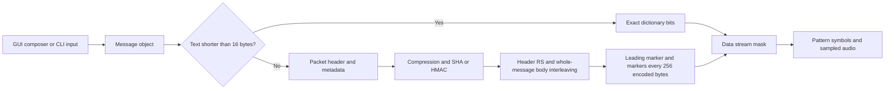

# Plan: fixed-interval data stream without packets or transmitted lengths

**Status:** historical migration plan; the fixed-interval transport is implemented.
[protocol.md](protocol.md) describes current behavior and
[validation.md](validation.md#earlier-fixed-interval-migration--september-2026)
records the migration checks. The code-path audit and staged recommendations
below describe the pre-migration checkout, not current development requirements.
The fixed short dictionary was subsequently restored and extended to **1–16
source bytes inclusive**; explicit raw bits and per-bit pending reception are
also required. Preserve these alongside longer fixed-interval messages under
the [development contract](development.md).
**Reviewed:** 14 September 2026, checkout `7c63c5e`.

## 1. Recommendation and scope

Replace the compact packet layer with a stream of **one fixed size of 128 encoded bytes per interval**. The receiver determines interval boundaries from the alignment marker and established symbol clock and corrects each interval independently. **The six-second iterative-search window with no symbols is the sole stream-ending rule in every mode and input path.**

Apply the user's latest requirements directly:

- No transmitted packet length, original-content length, variable header, filename length, content-kind field, random packet identifier, or repeat-request flag.
- One interval size for the product. The 64/128/256 comparisons below are design comparisons, not a proposed runtime interval-size control.
- Reed–Solomon parity at fixed positions in every interval.
- No modem SHA-256 digest or replacement modem checksum for unencrypted streams.
- For encrypted streams, retain the existing independently keyed **HMAC-SHA256**, at a fixed position in every interval and protected by that interval's RS parity. No whole-message digest/footer.
- Only the iterative search establishing six seconds covered by consecutive fully scored failed symbols emits a stream-end event. One failure suffices when a symbol lasts six seconds or longer; there is no partial-symbol preemption. Packet/header results, FEC/MAC success or failure, interval occupancy, codec end markers, EOF, cancellation, quotas and receiver replacement never end a stream.
- Symbol evidence controls acquisition and the six-second timeout. FEC/MAC results do not restart that timer, admit timing hypotheses, or keep a stream open.
- Keep XZ/LZMA2 compression outside the modem. Decompression may start only after that physical stream-end event; no compressed preview or speculative decoder may run beforehand.
- Fixed scratch buffers, bounded output queues and a local content quota control memory even when a signal never stops.

The user's accepted post-end compression layer provides the simplest candidate for underfilled intervals: **one agreed compressed source stream, with zero fill in its final data area**. Only after the six-second event does the application decompress it and validate the remaining fill. The compression codec recovers the exact original bytes without a modem length or per-byte occupancy field. For a separately selected exact uncompressed-byte profile, fixed validity bits remain an alternative with a measurable capacity cost; the choices are detailed below.

This removes the packet grammar rather than renaming packets to “frames.” Positional FEC groups still exist: RS needs a known codeword geometry, but that geometry comes from local constants, not received fields.

## 2. What was actually in the supplied bitstream

The supplied dump contains 1,079 bits. Its first 192 bits exactly match the repeated alignment marker. The remaining 887 bits are one bit short of the current packet's expected 888 bits. Appending `0` yields zero RS corrections and a passing SHA-256 check.

The recovered source is 44 bytes, including the final space (shown as a quoted string):

```text
"the quick brown fox jumps over the lazy dog "
```

| Existing region | Size | Actual meaning in this example |
|---|---:|---|
| Alignment marker | 192 bits / 24 byte-equivalents | Two copies of the 96-bit word |
| Packet header | 4 bytes | `11 57 07 5f`: compressed text, RS20, body length 87, CRC16 |
| Header RS parity | 2 bytes | `3c 22` |
| Body metadata | 24 bytes | 16-byte random ID, 4-byte ID checksum, three zero string lengths, original-size byte `2c` = 44 |
| Compressed source | 31 bytes | 245 fixed-prefix-code bits plus three packing zeros |
| Public SHA-256 digest | 32 bytes | Accidental-error integrity check; not keyed authentication |
| Body RS parity | 18 bytes | One shortened RS(105,87) codeword |
| **Total expected** | **1,080 bits / 135 byte-equivalents** | 111 packet bytes plus the marker |

There is no filename, callsign, grid value, or repeat request in this example. Nevertheless their empty-length fields, the ID, both checksums and the original length are present. The missing bit is in the final parity byte, not in the text.

This example was rejected at the byte-alignment gate in `src/transfer.cpp` (reviewed checkout), before RS was called. A byte-truncated version would also fail the strict body-size check in `src/packet.cpp` (reviewed checkout). Appending `1` instead also recovers the same text, with one corrected byte. The failure demonstrates a dependency on the packet envelope, not exhausted FEC capacity.

## 3. Current code paths and dependencies

### Transmit



The high-level split occurs in `src/transfer.cpp` (reviewed checkout). Text below 16 source bytes bypasses packets, markers, MAC and FEC; larger text and all attachments use the packet codec. Direct `pack`/`unpack` APIs additionally expose packet bytes to CLI consumers. The physical transmitter already accepts raw bits, but retains a complete source-bit vector; streaming PCM generation is not yet an incremental source-byte API.

### Receive


The physical receivers do not normally need packet lengths. Their explicit packet dependency is the recently added `packet_complete` callback. It probes a header-derived exact extent and validates a packet before closing accumulation across a short gap. Removing that callback is necessary, but insufficient: every subsequent layer still expects a whole burst or a `DecodedPacket`.

| Area | Current dependency | Required replacement |
|---|---|---|
| `src/packet.cpp` (reviewed checkout) | Tries protected header sizes and FEC modes; parses canonical ULEB128 body length | Fixed local interval/FEC profile; no received bootstrap |
| `src/packet.cpp` (reviewed checkout) | Three string lengths, original length, kind, flags and ID checksum | Opaque source bytes; local display/save choices |
| `src/packet.cpp` (reviewed checkout) | Column interleaving across all body codewords; row count and final width depend on total body length | One independent codeword per interval |
| `src/packet.cpp` (reviewed checkout) | Exact body extent, final SHA/MAC, original-size-selected decompression | Interval correction and encrypted-only interval MAC; separate decompression after the six-second end event |
| `src/transfer.cpp` (reviewed checkout) | Reinterprets whole bursts and requires exact packet consumption | Incremental fixed-interval consumer |
| `src/transfer.cpp` (reviewed checkout) | Packet completion hook crosses into physical RX | Explicit physical stream-finalization events |
| `src/streaming_modem.cpp` (reviewed checkout) | Thin wrapper emits whole pattern bursts; old byte/frame methods are mostly stubs | Drainable interval/decision events with absolute coordinates |
| `src/live.cpp` (reviewed checkout) | Copies whole provisional prefixes; one-shot content reporting and packet-ID upgrades | Bounded chunk delivery, preview deltas and local stream IDs |
| `src/gui/controller.cpp` (reviewed checkout) | Validated packet goes into an ID-indexed inbox; transmitted kind chooses text/file handling | Receive opaque bytes with independent correction/authentication status |
| `src/gui/state.cpp` (reviewed checkout) | Cache replacement by transmitted ID | Local reception identity and observed byte offsets |
| `src/gui/inspection_model.cpp` (reviewed checkout) | Estimates and diagrams encode/inspect a full packet | Arithmetic from fixed geometry and local input size |
| `src/main.cpp` (reviewed checkout) | Packet scratch, kinds, filenames, `pack/unpack`, packet JSON | Stream input/output and local-only presentation options |

The older `docs/original-specification.md` (reviewed checkout) explicitly described repeatable packets and a text/file packet format. The user's current direction supersedes those sections; they should not be used to retain the old parser in the new receiver.

## 4. Security assessment

Removing the variable packet envelope removes avoidable untrusted grammar and dependencies between received lengths, allocation sizes and indexing. That is a sound simplification for this data pump.

It would be inaccurate to report an identified buffer-overflow exploit from this review. The current implementation includes checked arithmetic, bounded canonical integers, small fixed header searches, filename checks, codec output limits and an explicit LZMA allocator limit. These checks should remain until the old code is actually removed. The review found architectural complexity and memory-accounting concerns, not a reproduced memory-corruption vulnerability.

Two separate properties need attention:

1. **Memory safety:** every index/write stays within its allocation. Removing received length fields reduces the proof burden; fixed-size code can still have indexing defects. Length inconsistency is a recognized failure class, as described by [CWE-130](https://cwe.mitre.org/data/definitions/130.html).
2. **Resource bounds:** all live allocations and queued output fit local quotas. Six seconds of weak symbols does not constrain a continuously confident sender. [CWE-400](https://cwe.mitre.org/data/definitions/400.html) describes the separate resource-consumption issue.

Current concrete concerns to eliminate in the redesign:

- Packet scratch limits are not an aggregate process-memory cap. Caller-owned bit/byte copies, content cache and separately bounded LZMA scratch coexist.
- `provisional_pattern()` copies the complete prefix before live's geometric reporting throttle decides whether to parse it.
- Live constructs a full ASCII bit string before GUI truncates it to 4,096 characters. Event count limits alone do not bound those strings' total bytes.
- Received-cache accounting primarily charges decoded content, although `Received` also owns raw bits and diagnostics.
- A healthy long burst accumulates until a hard bit/workspace error; it does not drain completed coding intervals.
- Public digest validation does not make an attacker-supplied input trustworthy: the sender can calculate the digest. Removing the public digest must not weaken local bounds or safe display behavior.

The target modem boundary should have no remotely supplied field that controls allocation, loop geometry, destination path, file type, command, or decompressor dispatch. A separately bounded XZ decoder may parse its compression format after the physical stream has ended. Its internal structure is acceptable under the user's stated scope and does not justify retaining modem packet fields.

## 5. Choose one interval size

Here **interval size means encoded bytes, including RS parity and any keyed integrity field, between alignment markers**. It does not mean that many source bytes plus overhead.

Proposed wire order:

```text
marker | 128 encoded bytes | marker | 128 encoded bytes | ... | silence
```

Each marker precedes an interval. Do not add an extra marker merely to announce the end. This deliberately changes the current insertion rule, which also emits a marker after an exact final 256-byte interval. With the proposed ordering, each transmitted interval costs exactly `192 + 128*8 = 1,216` one-bit symbols, excluding hardware settling, pulse tails and the silent separation time.

| Design candidate | 64 encoded bytes | **128 encoded bytes** | 256 encoded bytes |
|---|---:|---:|---:|
| Interval plus one 192-bit marker | 704 bits | **1,216 bits** | 2,240 bits |
| Ordinary RS geometry in this codec | One RS64 word | **One RS128 word** | Two words or a codec/layout change |
| RS20 systematic / parity bytes | 52 / 12 | **106 / 22** | 212 / 44 across two RS128 words |
| RS60 systematic / parity bytes | 40 / 24 | **80 / 48** | 160 / 96 across two RS128 words |
| Keyed RS20 data area after HMAC32 | 20 bytes | **74 bytes** | 180 bytes |
| Keyed RS60 data area after HMAC32 | 8 bytes | **48 bytes** | 128 bytes |
| Marker overhead relative to coded bytes | 37.5% | **18.75%** | 9.375% |

**Recommend 128 as the single size.** It halves coded-interval commitment versus 256, uses one existing-codec RS word, and avoids the very small encrypted payload areas of 64. Its new RS20 parity/source ratio is about 20.75%; RS60 remains 60%. The names are local presets, not transmitted flags.

128 is still substantial on a slow link: 1,216 symbols take about 20.3 minutes at 1 bit/s, 121.6 seconds at 10 bit/s, or 12.16 seconds at 100 bit/s. These are arithmetic illustrations, not measured modem throughputs. With uncompressed 44-byte text fitting one interval, the proposed fixed interval costs 1,216 bits versus the old example's 1,080 bits. The architectural simplification does not automatically reduce every short message's airtime.

Keep the existing explicitly selected few-bit/raw signaling path for extremely slow beacons if that capability remains required. It uses the same six-second end rule, remains visibly without FEC/MAC, and must not be selected by guessing source length after a decode fails. Do not introduce a menu of 64/128/256 interval sizes to compensate for these tradeoffs.

## 6. Fixed interval layout and encryption

All layouts below have the same 128-byte encoded width. The local link profile selects FEC and whether a key is present; no header or transmitted mode flag is needed.

| Local profile | Data area, unencrypted | Data area, encrypted | Keyed HMAC | RS parity | Ordinary byte-error capacity |
|---|---:|---:|---:|---:|---:|
| FEC off | 128 | 96 | 32 only when encrypted | 0 | 0 |
| RS20 | 106 | 74 | 32 only when encrypted | 22 | 11 |
| RS60 | 80 | 48 | 32 only when encrypted | 48 | 24 |

For encrypted RS20, for example:

```text
74 fixed data-area bytes | 32 HMAC bytes | 22 RS parity bytes
```

For unencrypted RS20:

```text
106 fixed data-area bytes | 22 RS parity bytes
```

These data-area capacities are fully available to compressed bytes under the zero-fill proposal in section 7. The alternative uncompressed validity-cell representation reduces them. Tags have a fixed position within their selected profile; their location never depends on how many source bytes are present in the interval.

Compute HMAC over a fixed domain/version, canonical local profile, the canonical `(epoch, ordinal)` address of the interval's first coded symbol, and the entire fixed data area including occupancy/padding bits. The address is already defined by `include/datapump/symbol_schedule.hpp` (reviewed checkout) and used for Data masking. It supports later interval acquisition without recovering a transmitted packet ID or the original stream's start counter.

Do not use noisy measured frequency, estimated fractional sample offsets, or a counter incremented only for successfully received intervals as MAC context. If the canonical address cannot be established, leave authentication unresolved. Preserve existing key/epoch acceptance and reuse limitations: the address identifies a schedule position, not a fresh unique transmission nonce.

Use the existing independent MAC key and HMAC-SHA256 construction; do not substitute an unkeyed SHA-256 hash merely because its output is encrypted. HMAC is the existing secret-key authentication mechanism described by [RFC 2104](https://www.rfc-editor.org/rfc/rfc2104.html). No new cryptographic primitive or nonce field is required by this plan.

Order the operations as follows:

```text
TX: fixed data area -> keyed HMAC when enabled -> fixed RS -> fixed markers -> existing Data mask -> patterns
RX: pattern decisions -> existing Data unmasking -> marker removal -> fixed RS correction -> keyed HMAC check -> fixed data area
```

Markers, data, HMAC and parity all consume normal symbol/keystream positions. Never restart the mask at a block boundary or skip its positions for missing bits.

### Marker confidence

The reviewed checkout already sets `false_match_bits=84`, allows up to 80 contiguous missing marker bits within its bounded deletion model, and treats unknown timed slots as no evidence in `include/datapump/boundary_sync.hpp` (reviewed checkout). Keep the 192-bit repeated marker and that target when changing cadence. This is a modeled random false-match bound, not proof of uniqueness or resistance to a sender deliberately transmitting the public marker.

The current acceptance calculation charges the number of candidate paths and marker slots in one call. An incremental receiver must charge repeated attempts consistently across the declared search scope; restarting an independent `2^-84` budget on each update does not establish the same bound over their union. At the denser 128-byte cadence, recompute that accounting and retain rejection of competing plausible alignment endpoints. Neither a marker match nor failure ends the stream.

### Erasures

Retain missing-bit positions through marker removal and byte packing. A byte containing an unknown bit becomes a declared byte erasure. Extend the existing RS algebra to accept an erasure mask; the mixed budget is `2*errors + erasures <= parity_bytes`. This can handle 22 erased bytes for RS20 or 48 for RS60 when there are no additional unknown-location errors. The existing errors-only decoder can first be extracted without behavioral change; erasure support should be independently checked before integration. The [Linux RS interface](https://docs.kernel.org/core-api/librs.html) illustrates an explicit erasure-position API.

An observed weak final symbol need not prevent interval decoding: the recognized marker fixes the expected interval extent. Supply unknown slots to that fixed extent, without adding marker confidence or changing symbol admission, and attempt the bounded RS correction. This directly removes the one-final-bit byte-alignment failure illustrated by the supplied dump. Excessive missing bytes make that interval uncorrectable; they do not make the buffer grow or prevent later intervals from being attempted.

Zero is only the stored placeholder value for an unknown slot; its erasure flag remains authoritative. In particular, a public FEC-off interval with unknown source or validity bits cannot be accepted merely because zero filling makes its occupancy pattern plausible. A missing `present=1` bit for a real zero byte must never silently turn that byte into padding.

## 7. Exact source bytes without packet lengths

Ordinary zero padding alone is not reversible for opaque uncompressed bytes. Source `41` and source `41 00`, padded to the same fixed width, produce the same data bytes and RS parity. Silence cannot recover which source length was intended. A zero-valued transmitted bit is also a real modem symbol, not silence. An agreed compression codec can supply the missing source representation outside the modem, strictly after physical stream end.

### Recommended compressed profile: fixed data area and post-end zero-fill validation

Transmit exactly one raw LZMA2 stream using an agreed local dictionary profile, including the codec's own end marker. Copy its compressed bytes into the fixed interval data areas; zero-fill only the final underfilled area. Add no all-padding interval when the compressed stream exactly fills an area. This preserves today's raw LZMA2 codec family while removing the packet envelope and original-size dependency.

The modem corrects/authenticates fixed areas and spools them as opaque bytes. It does not look for a compression end marker. After the iterative search establishes six seconds without symbols, the application:

1. Confirms that every collected interval needed for this reconstruction is available and passes the applicable correction/authentication checks.
2. Starts bounded raw LZMA2 decompression and requires `LZMA_STREAM_END`.
3. Requires that every remaining input byte is zero and that fewer than one data area's worth remain: `remaining < C`, where `C` is the fixed data-area capacity for the local profile.
4. Publishes the bounded decompressed output only if these checks pass.

The remainder test runs after physical end and within the separate application codec. It is not a modem delimiter or a transmitted length. Exact original trailing zero bytes survive because they are represented inside the compression stream. RS20 retains 106 compressed bytes per public interval or 74 per encrypted interval; RS60 retains 80 or 48. With this exact convention, dropping the final complete interval removes the codec endpoint, because no padding-only interval exists. Strict post-end decoding then reports truncation. That is structural source validation, not another way of declaring the physical stream ended or a universal completeness/authentication guarantee.

Use the codec's actual consumed-input position for this check; never scan for an apparent zero end byte or strip zero suffixes before decoding. Do not feed unresolved placeholder bytes to the codec or concatenate around missing intervals: a fabricated zero can otherwise look like a codec control value. Reject a second concatenated codec stream in this proposed profile.

This profile must always emit the agreed codec, even when compression expands the source. The current “only use compression when smaller” fallback cannot silently put raw bytes on the same locally selected profile. Short-message compressed sizes need measurement before freezing the choice. If full XZ replaces raw LZMA2, define its permitted container padding separately; do not accidentally enable container concatenation or different checksum policies through a default decoder option.

### Exact uncompressed-byte alternative: fixed slots with validity bits

Divide the fixed data area into a compile-time number of nine-bit cells:

```text
present bit | eight source-byte bits
```

- `present=1` carries one byte, including `00` or `ff`.
- `present=0` carries no byte; its eight remaining bits must be zero.
- Require present cells to form a prefix within an interval. Remaining cells and any spare final bits are canonical zero fill.
- A not-present cell is not end-of-stream. Later intervals can carry more bytes. Only the six-second absence established by iterative search ends the stream.
- RS and the keyed MAC cover the validity bits and fill bits as well as data.
- The decoder always visits the same fixed number of cells and writes at most the fixed capacity. No received integer selects a size, index span, allocation, or alternate parser.
- If correction leaves validity bits unknown, the original source-byte count for that interval is also unknown. Emit an unresolved interval at its coded-symbol address; do not guess a source offset or treat it as empty. Later intervals retain their own addresses, and whole-source reconstruction remains incomplete.

This is occupancy information. It is not literally a stream with no structure, but it avoids a length parser and an end token. It also avoids an extra all-padding interval when source size is an exact multiple of capacity.

| Profile | Unencrypted source bytes per interval | Encrypted source bytes per interval |
|---|---:|---:|
| FEC off | 113 | 85 |
| RS20 | 94 | 65 |
| RS60 | 71 | 42 |

The cost is roughly 11.1% of the data-area bit capacity, plus rounding. A 44-byte message fits one RS20 interval in either mode. It needs two encrypted RS60 intervals with validity cells, versus one if the entire 48-byte data area were available as ordinary bytes. That is a real slow-link tradeoff.

The source-byte codec only handles byte streams. Preserve exact one-to-few-bit beacons through the separate raw-bit path, or separately design fixed bit occupancy if protected non-byte source lengths become a requirement. Do not silently pad a raw bitstream and claim its original bit length survived.

### Alternatives and reasons to defer them

| Alternative | Advantage | Cost or conflict |
|---|---|---|
| Final `0x80` followed by zero padding, inspected only after silence | Ordinary data-byte capacity; very small padding parser | One-interval holdback; exact multiples require an extra interval; loss of the actual final interval can make ordinary prior data look like padding |
| Escaped padding token interpreted only after silence | Low typical overhead and preserves arbitrary bytes | Adds a stateful source grammar; any use of the token itself to end the stream is excluded |
| Shortened final RS word derived from observed duration | Less final airtime | Final tag/parity positions differ from regular intervals; missing-tail length becomes ambiguous, especially with no public digest |
| Keep all padded bytes as source | Simplest fixed geometry | Does not preserve exact arbitrary files or trailing zeros |

For the compressed profile, prefer ordinary fixed data areas and the post-end codec rule above. If exact uncompressed byte delivery is also required, prototype validity cells and compare their airtime with the alternatives before freezing that local source profile. Do not quietly add a last-interval length field to recover capacity. None of the source-byte representation alternatives may supply another stream-ending rule.

## 8. Physical end, interval validity and completeness are different states

Introduce explicit events such as:

```text
IntervalData(local_stream_id, absolute_symbol_address, bytes, correction_status, authentication_status)
Preview(local_stream_id, bounded_revision_or_delta)
StreamEnded(local_stream_id, observed_silence_start, observed_silence_end)
ProcessingInterrupted(local_stream_id, local_reason)
```

All IDs, byte counts and spans in these APIs are local bookkeeping, not received packet fields.

Only the iterative-search controller may emit `StreamEnded`, after it has established the six-second absence from received samples. Do not give this event alternative reasons. The existing `PatternBurst.complete` cannot supply this contract: a provisional view sets it on the first pending gap while the track is still retained, and live/GUI deduplication can suppress the later actual timeout event.

The audit found these concrete alternate completion/decompression paths to remove:

| Current path | Conflict and replacement |
|---|---|
| `src/pattern_receiver.cpp` (reviewed checkout) | Final processing publishes and erases a track regardless of observed absence. EOF may flush observed decisions but cannot declare stream end. |
| `src/pattern_correlator.cpp` (reviewed checkout) | `finish()` publishes and clears every hypothesis. Separate processing shutdown from the sole search-derived end event. |
| `src/transfer.cpp` (reviewed checkout) | Offline receive calls `finish()` at input EOF, then interprets output. Preserve an incomplete state when the capture lacks six seconds of absence. |
| `src/transfer.cpp` (reviewed checkout), `src/live.cpp` (reviewed checkout) | Simulations append two or three symbol periods before finalization. Generate sufficient actual samples for the same six-second search rule instead. |
| `src/packet.cpp` (reviewed checkout) | `preview_packet_partial()` can call `compression::preview_long()`. Remove compressed previews from active reception. |
| `src/packet.cpp` (reviewed checkout) | Successful packet decoding invokes decompression immediately. Move codec invocation behind the physical end gate. |

EOF, capture failure, cancellation, quota exhaustion and receiver replacement are processing interruptions, never evidence of a completed stream. Release local buffers or stop retaining content when necessary, report the reception as incomplete, and do not hand it to XZ. If sampled input is still available, retain bounded search state until the actual six-second event, even after the content quota is exhausted. A recorded input that stops without the required observed absence remains incomplete; file EOF must not synthesize silence.

Share one full-symbol absence policy between FFT, correlator and live reception. A completed symbol is judged from its full pattern evidence. Consecutive missed symbols end the stream when their combined received-media duration reaches six seconds. If one symbol itself spans six seconds or longer, that one miss ends the stream. There is no minimum-two-symbol exception and no partial-window probe that prematurely rejects an unfinished long symbol.

This follows the user's implementation clarification: survive burst interference lasting a large fraction of six seconds, while ending after a wholly missed long pattern. Evaluate rate-corrected duration and preserve the same physical-only rule for raw bits, protected bytes, public/keyed modes, live audio, WAV and simulation.

Do not use RS success, HMAC success, a valid-cell count or a source padding pattern to end the stream or keep the active clock alive. FEC can deliver corrected interval bytes to bounded storage during reception; this is internal progress, not a completed received message. XZ decompression, including previews, is gated strictly on `StreamEnded`.

Independent HMACs authenticate the intervals that arrived at their canonical positions. They do not prove that a later interval was not suppressed. After a long fade or lost final interval, the receiver can report an ended receiving segment, not cryptographic proof that the sender's entire intended file arrived. Missing interior intervals can be reported when later timing/markers establish the gap. No message-level footer or total count is proposed to conceal this limitation.

Public streams have only symbol evidence and RS correction. Display that status accurately; do not label them authenticated or digest-verified. Arbitrary public transmitters can generate valid RS codewords. This is consistent with the requested removal of the public digest.

## 9. Bounded continuous reception and transmission

### Receiver storage

Replace whole-burst accumulation with a drainable stream consumer. Retain only:

- Existing bounded physical acquisition/integration state.
- A bounded marker search/overlap window, fixed interval buffer and byte-erasure mask.
- Compact unresolved-gap counters/ranges, not a vector proportional to six seconds at the highest possible bit rate.
- Fixed RS scratch and keyed MAC state.
- A bounded preview and byte-budgeted pending output.

An indefinitely good signal must drain intervals without increasing core memory. Local content cache limits still apply: the current 256 MiB default is an application-content policy, not permission to allocate that amount for every receiver candidate or event queue. Account raw diagnostics, decoded bytes, masks and queued ownership transfers as well as displayed content.

Maintain absolute cipher/marker coordinates when draining. Committing output must not reset the clock, phase, epoch, marker phase or stream ordinal. Define a bounded candidate-selection/commit policy: competing provisional hypotheses may replace a preview, but must not silently rewrite already delivered bytes. Use local IDs/revisions to retire superseded candidates explicitly.

On stalled consumers, apply a documented bounded backpressure/drop policy and mark missing output as incomplete. Do not silently drop a middle chunk and join its neighbors, or call storage exhaustion a stream end. PCM overruns currently recreate the bank without preserving omitted sample counts; report these as processing discontinuities, not invented one-bit erasures or six seconds of observed silence.

Because XZ must wait, corrected compressed bytes need a bounded sink until `StreamEnded`: a capped memory buffer or a capped temporary-file spool. A spool avoids retaining the entire compressed stream in RAM but still needs a disk quota. When that quota is reached, stop retaining content and mark it incomplete while continuing the bounded physical search if input remains available. No decompressor runs merely to make room, and a missing compressed interval is never removed and its neighbors joined into an apparently intact input.

### Sender separation and simulation

The current GUI cooldown and CLI `--tx-delay` are primarily enforced for encrypted output. Unencrypted sends and queued session work do not universally guarantee a six-second gap. Hardware settling is approximately two seconds; simulation often adds only three symbol periods of post-signal noise. None is a general replacement for the proposed physical delimiter.

If separate Send actions are intended to produce separate receiving streams, enforce at least six seconds of observable symbol absence, rounded up to a full-symbol decision opportunity, plus the measured waveform-tail and timing/search margin, in the common TX scheduler for all modes and entry points. Under the old whole-symbol implementation, the failed-symbol opportunity was instead quantized by `T * max(2, floor(6/T)+1)`; remove that implementation-dependent end rule rather than making it the new specification. Evaluate cross-profile cases explicitly. Two sends without an intervening six-second absence remain one physical stream, regardless of separate Send actions or valid compressed end markers.

Simulation must supply actual sampled silence/noise sufficient for the same six-second search window; do not pass a transmitter-known end/length directly into reception. EOF without those samples remains incomplete. Distinguish physical transmission time, receiver-finalization delay and the GUI's shortened replay clock.

The first implementation may use a bounded local source buffer. An unknown-length pipe/live producer additionally requires a source callback and a producer-close/flush operation in `PatternTransmitter`; generating PCM in chunks from one complete bit vector is not enough. That local producer operation stops transmission and schedules silence; it never supplies a receiver stream-end event. Producer starvation, final flush and mandatory inter-send silence need separate states.

## 10. Compression and application metadata

**The modem transports opaque bytes; compression belongs to the application stage.** The modem does not need to know whether those bytes are text, a screenshot, compressed data or a file. Generate local reception IDs and default filenames such as `received.bin`. Do not transmit or automatically parse filenames, types, callsigns, grid values or repeat commands. Callsigns and the existing GUI's repeatable text prefix can remain ordinary user-visible source text.

The current short dictionary has an exact-bit API that uses bounded 3/4/6/13-bit tokens without an original-length field. The packed packet variant relies on original size to distinguish real characters from zero fill. It cannot be retained unchanged.

**Keep XZ/LZMA2 support, with a strict post-end gate.** The user explicitly accepts its internal compression grammar outside the modem. The library currently uses raw LZMA2, rather than the full XZ container, and derives both its dictionary profile and exact output allocation from the packet's original-size field in `src/compression_lzma.cpp` (reviewed checkout). Those dependencies must be replaced; they do not require dropping compression.

The target pipeline is:

```text
modem search -> interval RS -> encrypted-only HMAC -> fixed data areas
            -> bounded compressed-byte spool
            -> six seconds without symbols established by iterative search
            -> sealed received input -> separate bounded XZ/LZMA2 decompression
            -> application text/file result
```

- During reception, the application may display bounded signal/progress information. Do not call `decode_long`, `preview_long`, a codec probe, or any other XZ decompression path before `StreamEnded`.
- For raw LZMA2, replace the original-size-derived dictionary with one agreed local profile and decode incrementally into bounded output chunks after the end event. The local output quota is a limit, not a transmitted expected size; require codec completion and enforce the quota without trusting an original-length field. Replace today's unconditional rejection of leftover bytes with the strict final-area zero-fill rule in section 7 for the compressed profile.
- A full XZ container is also compatible with the user's rule when interpreted by this separate post-end stage. It would be a deliberate source-codec change from today's raw LZMA2, not a modem framing requirement.
- A codec end marker only tells the application that decoding completed after reception ended. It cannot close the modem stream, bypass the six-second wait, restart reception or hide trailing received bytes. Define trailing/concatenated compressed data behavior in the application codec contract.
- A stream may end physically and still contain an uncorrectable interval, failed MAC or truncated compressed data. Those conditions prevent a successful decoded result; they do not change when the physical stream ended. Never call a failed or incomplete decode a received text message.
- Bound compressed-input storage, decompressor scratch, decoded output and work/cancellation separately. Codec failure releases its own resources and does not invent a radio-stream boundary.

Do not retain “compress only when smaller” or the hidden 15/16/255/256-byte protocol switches without an agreed source-codec convention. Select the source codec locally, outside the modem; no packet header or received kind field should trigger decompressor dispatch. The same physical end gate applies whether the selected application output is raw bytes, text or decompressed content.

## 11. Implementation sequence

Each stage should leave a reviewable boundary. The stages below guided the implementation authorized after the review.

### Stage 1 — freeze constants and observable lifecycle

- Specify the one 128-byte coded interval, marker-before-interval ordering, FEC presets, encrypted-only HMAC positions, canonical MAC context and selected application source-codec/padding convention.
- Separate pending-gap preview from true stream finalization in `PatternBurst`, streaming wrapper, live events and GUI state.
- Make the six-second iterative-search window the sole end-event producer across both receivers, live banks and every input/mode; use full-symbol evidence and remove the minimum-two-symbol exception.
- Define whole-interval loss, processing interruption and quota status separately from stream ending.
- Gate every XZ/LZMA2 entry point, including previews, on the physical end event.

**Acceptance:** a gap shorter than six seconds does not finalize; a resumed signal updates the same stream; the six-second event arrives once even when no new source bits arrive. EOF, codec completion, FEC/MAC results, quota exhaustion, cancellation and receiver replacement cannot emit it. An instrumented decompressor receives zero calls before it.

### Stage 2 — extract fixed FEC and source-byte codec

- Move generic GF(256) RS routines from packet ownership to a dedicated module.
- Implement fixed RS(128,106) and RS(128,80) with bounded arrays; remove dependence on whole-message row counts.
- Add and validate errors-plus-erasures correction.
- Implement keyed-only interval HMAC over the entire fixed data area. For compressed input, keep those bytes opaque; optionally implement fixed source cells only for a separately selected exact uncompressed profile.
- Keep profile selection local and bounded; no received header probe or legacy fallback.

**Acceptance:** every data-area fill count and trailing-zero case round-trips through the selected post-end source codec; any uncompressed validity-cell profile is also checked exhaustively. Error/erasure budgets hold including parity damage; wrong keyed profiles/addresses fail authentication; public intervals contain no modem digest.

### Stage 3 — incremental markers and interval collection

- Replace whole-input `boundary_sync::recover_packet` with stateful fixed-cadence collection and an erasure-preserving result.
- Change the coded interval from 2,048 to 1,024 bits; recompute marker slot/trial accounting for that cadence and cumulative incremental attempts.
- Keep the 192-bit marker, zero evidence from unknown slots, unique-endpoint rejection and bounded searches.
- Emit fixed blocks from both physical RX implementations while retaining timing independently.
- Attempt missing final codeword slots within the fixed interval; never scan arbitrary candidate packet lengths.

**Acceptance:** leading/periodic marker loss, last-bit loss, epoch crossings and repeated drains retain exact bit/byte/keystream positions; later intervals recover after an uncorrectable interval.

### Stage 4 — detach packet completion and deliver stream chunks

- Remove `PatternSearch::packet_complete`, `packet_content_limit` and `transfer::pattern_packet_complete`.
- Replace whole-burst `interpret_pattern` and `Received::packet` with interval/chunk result types.
- Replace `content_reported`/packet-ID reporting with local stream IDs and byte cursors.
- Enforce byte quotas for previews, event queues, raw diagnostics and the pending compressed-byte spool; quota exhaustion never finalizes a stream.
- Seal the received source only on the six-second end event, then invoke the separate application codec. Replace original-length-sized decompression with bounded post-end output.
- Preserve safe display, explicit saves and user-controlled clipboard actions.

**Acceptance:** traffic far larger than decoder workspace drains with stable core memory; stopped GUI polling stays bounded; no dropped interval is silently concatenated out of the output.

### Stage 5 — TX, CLI, GUI and estimation

- Encode intervals directly from source chunks; retain the existing cipher/symbol schedule and waveform generation.
- Enforce stream separation in the shared scheduler and update sampled simulation tails.
- Replace `Message` metadata and `DecodedPacket` assumptions in inbox, copy/save and inspection models.
- Derive estimates from the locally encoded source size and fixed data-area capacities, or validity-cell capacities for that alternative; no packet construction is needed for estimates. Compression may be run locally on TX for an exact estimate.
- Report received bytes, missing slots, uncorrectable intervals, corrected data/parity bytes and keyed authentication separately. Remove the misleading packet-centric verified/expected-length semantics.

**Acceptance:** identical receive behavior through live audio, WAV and simulation; text and arbitrary binary bytes can be copied/saved exactly; no transmitter endpoint is injected into RX.

### Stage 6 — remove the old parser from the protected build

- Delete `encode_packet/decode_packet`, packet header probes, packet layout/preview, original-length parsing, metadata grammar and whole-message interleaving after callers have migrated.
- Remove or separately retire CLI `pack/unpack`, packet JSON fields and their implicit compatibility paths.
- Move XZ/LZMA2 invocation wholly behind the application stream-end gate; remove packet-selected decompression and pre-end compressed previews. Retain the accepted compression library outside the modem.
- Update CMake linkage, protocol/security/requirements/inspection docs and tests; mark the older packet specification superseded.
- Do not leave an automatic old-packet decoder enabled in the new live receiver. Any historical conversion utility should be a separate explicit offline tool, if needed at all.

**Acceptance:** receive-callgraph and build-dependency review finds no old modem packet grammar reachable from PCM, decoded bytes, GUI input selection or automatic fallback, and no XZ call reachable before the sole end event. The separate post-end codec remains available. An incompatible format change is documented for both peers.

## 12. Verification plan and evidence gathered

### Experiments completed for this review

- Decoded the exact supplied bitstream with one restored final zero; recovered the 44-byte text with zero RS corrections and passing old-format SHA validation.
- Checked every one-bit insertion position/value for that sample: only the final-zero insertion required no correction; corrected successful candidates produced the same source text.
- Linked a small standalone probe against the existing generic RS routines. RS(128,106) repaired 11 erroneous bytes, and RS(128,80) repaired 24, including final parity damage. No packet header was used in those probes.
- Prototyped fixed nine-bit byte cells for data areas 106, 74, 80 and 48 bytes. Every possible occupied-cell count and tested trailing-zero suffix round-tripped within the exact fixed area.
- Probed the bundled raw LZMA2 codec with a fixed 4 KiB dictionary: 1,364 zero-padded round trips across those four capacities passed, including empty input, trailing source zeros and 18 exact area multiples. Removing the final complete data-area interval failed decoding in all cases. This checks padding feasibility; it does not test a production six-second lifecycle gate or new incremental wrapper.
- Traced transmitter, both physical receivers, wrapper, transfer codec, live queues, GUI storage/copy/save, CLI, compression and existing memory checks.

These are architecture feasibility checks, not validation of a new production receiver. These initial experiments preceded the production implementation; current regression coverage lives in the test suite.

### Required regression and adversarial matrix

| Dimension | Required cases |
|---|---|
| Fixed format | Every profile, empty/one/full/underfilled interval, fixed tag/parity offsets, no received length fields |
| Source bytes | Every byte value, embedded marker-like bytes, trailing `00`/`80`/`ff`, exact compressed-area multiples, expanded/empty compressed input, malformed final fill; validity bits if that alternative is selected |
| Corrections | Data/MAC/parity errors; mixed erasures at and beyond `2e+s=p`; one lost final bit; whole interval lost; loss crossing a marker |
| Timing | Short gap, exactly six seconds of resolved search, one missed long symbol and full-symbol evidence, rate error, ambiguous private phase, EOF without observed silence |
| Cipher/MAC | Epoch transition, later interval acquisition, missing whole blocks without renumbering, wrong key/profile/address, reused-address limitations documented |
| Segmentation | Same-grid sends shorter/equal/longer than guard, long fades, no false claim of authenticated whole-stream completeness |
| Memory/work | Continuous confident input exceeding workspace, all-unknown gap ranges, every admitted receiver/key bank, slow consumer, queue overrun, spool/output quota exhaustion, cancellation without false stream-end events |
| UI/CLI | Gap preview resumes, finalization not deduplicated away, exact chunk ordering, safe text/terminal rendering, explicit file save, bounded snapshots |
| Compression gate | Zero decompression/probe/preview calls before six-second end, even with a complete compressed stream already buffered; EOF/cancel/quota never bypass gate; malformed/truncated data, trailing data, bounded scratch/output after end |
| Parser retirement | Old packet/header entry points unreachable, no packet-selected compressed/type dispatch, no hidden format fallback |

Run ASan/UBSan and coverage-guided fuzzing against the fixed marker/interval/source-cell boundary, with allocation and work-count assertions. Test malformed but algebraically valid public RS inputs as ordinary hostile bytes. Check caps on the complete pipeline rather than relying only on successful unit tests or a local buffer-size estimate.

## 13. Decisions to freeze before implementation

The recommended baseline is concrete: **128 encoded bytes, one fixed interval, regular RS, encrypted-only regular HMAC, no packet fields, six-second iterative-search absence as the sole stream end, opaque modem data areas with final zero fill, and separate agreed XZ/LZMA2 decoding and fill validation only after that end.**

The remaining product tradeoffs should be decided explicitly:

1. Use the agreed compressed source profile and its post-end zero-fill rule. If exact uncompressed bytes are also required, choose their representation explicitly: validity cells preserve exact bytes at a capacity cost. Do not solve padding with an undisclosed integer length.
2. Keep a separately selected few-bit raw mode for very slow beacons; do not auto-switch the protected format at a source-size threshold.
3. Preserve raw LZMA2 with a fixed dictionary or choose the full XZ container as the separate application codec. Either runs only after the observed six-second end; neither needs modem packet lengths.
4. Report interval authentication separately from source-codec validation. The compressed profile can detect a removed codec endpoint after physical end; independent interval MACs alone do not prove the sender's entire intended transmission arrived. No additional modem endpoint or whole-message footer is proposed.

The plan does not require a per-message header, a packet parser, a total transfer length, a public digest, or a message-level digest/footer.
