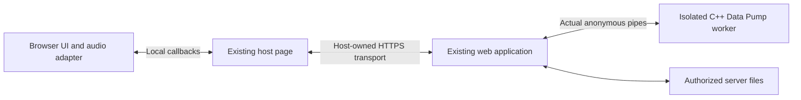

# Browser frontends with no socket I/O

The optional native `datapump-worker` and static `datapump-wasm` compositions use
the existing C++ application, a shared declaration bridge and browser audio.
The initial implementation is under qualification; a successful compile does not
establish browser, mobile-device or physical acoustic qualification. The original
design review used `91e3e0e3495ba842a380b4ea907a691c3a5b253a` on 2026-09-28.

Use [the build guide](building.md) for the separate native and Wasm builds,
[the local protocol](web-protocol.md) for embedding, and
[the browser adapter guide](../web/README.md) for preloaded assets and platform
services. Application packages contain no web server or listening helper.
[COMPILE-web](../COMPILE-web) and `tools/preview.py` provide an explicit,
temporary loopback host for repository experiments, outside the worker process.
CGI, persistent browser
storage and a threaded Wasm profile remain future work.

## Mandatory security boundary

Data Pump must not create, inherit, accept, connect, listen on or perform I/O
through any socket in these deployments. This includes loopback TCP/UDP,
Unix-domain sockets, `socketpair`, socket activation and sockets masquerading as
standard input/output. There is no bind-address setting or network fallback.
A loopback-only configuration cannot satisfy this requirement: a bind bug must
not be able to turn Data Pump into a network service.

Only the user's existing web server/embedding application owns network transport
in deployment. The separately invoked repository preview tool owns it during
local development; the worker and renderer retain the same boundaries.
Data Pump receives an explicitly bounded local interface: actual anonymous pipes
for the native worker, or local Worker messages for Wasm. Do not ship a Data Pump
HTTP daemon, socket broker, CGI-to-socket client or hidden networking helper.
The browser adapter likewise gets host-supplied messages/callbacks; it does not
open WebSocket, WebRTC, fetch/XHR or other network connections. Loading the page
is the hosting browser's operation; subsequent Data Pump processing stays local
unless the already networked embedding host deliberately relays the pipe protocol.

The native worker is a separate process, not a module inside the network server.
In-process callbacks provide code reuse but cannot isolate Data Pump from that
process's sockets; they do not meet this process-isolation profile. Enforce the
descriptor allowlist and a platform-qualified no-socket sandbox before processing
untrusted input. Audit direct and dependency behavior as well as attempted socket
operations; merely observing no listening port or blocking Internet access is
insufficient. Do not claim an unqualified platform provides this guarantee.

Incoming acoustic data remains untrusted payload. It must never be promoted to
host commands, filesystem paths, executable content, HTML or transport callbacks.
This preserves the project's attack-surface goal while retaining explicit user
file transfers. The existing web application is a separately trusted component;
its authentication and network exposure do not become Data Pump functionality.

## Two products using the same application

Both compositions are independent of the FLTK/Rev selection, like the existing
terminal and framebuffer frontends. They compile the existing C++ application
and modem code for each execution host and share a declarative HTML renderer
and browser audio adapter.
JavaScript supplies DOM, browser API and local message glue, not another implementation
of message handling, compression, cryptography, framing or DSP.

| Responsibility | Server-side worker: `datapump-worker` | Static client: `datapump-wasm` |
| --- | --- | --- |
| Application, modem and keys | C++ process on laptop/RasPi/server | C++ compiled to WebAssembly on phone/tablet/browser host |
| Capture and playback | Browser audio relayed by the existing host through actual pipes | Browser audio connected locally to Wasm |
| Transmit source and received destination | Server files selected through the embedding application's authorized file service | User-selected browser files and explicit downloads |
| Web serving | Entirely the existing web server/application; Data Pump has no socket I/O | Static hosting, including GitHub Pages; Data Pump makes no runtime network requests |
| Integration | Generic presentation/events and PCM over inherited pipes | The same presentation/events over a local Worker/Wasm bridge |

For the peripheral use case, the phone is the sound device and display; it does
not need copies of the server's source files or keys. The server still owns
encoding/decoding and file operations. For the thin client, selecting a file
imports it locally into the application; it need not upload anything to the
website's server. Received files are offered for download to that device.

The audio selector says **Browser audio** in both shipped compositions: capture
and playback use the browser's selected microphone and output. It does not
enumerate the server's sound cards. Server hardware remains a possible explicit
host audio adapter over the same bounded PCM pipe interface; no such adapter or
device-selection capability is supplied yet. The common application and modem
would continue using the audio-provider interface.

The ordinary native audio provider cannot simply be enabled in the worker: its
configured ALSA routes and PulseAudio/PipeWire fallbacks may use sockets. A direct
server-hardware provider needs qualified hardware-only routing, portable dependency
provenance, and busy-device, permission, disconnect and live RX/TX checks while
retaining the worker's socket prohibition. It must never silently fall back to a
sound server or change the browser's audio source.

The static deployment replaces the host relay and native process with a
local Worker hosting the Wasm application. It must operate without a native
Data Pump installation, extension, PHP or JavaScript modem implementation.

## Preserve the abstraction boundary

The existing [Application facade](../src/gui/application.hpp),
[UI contract](../src/gui/ui_contract.hpp), shared documents, record identities
and bitmap sources provide the presentation seam. The
[add-functionality-once rule](gui-architecture.md#adding-functionality-once)
continues to apply: adding ordinary controls, actions, documents or plots using
existing primitives requires no HTML-specific feature code.

The HTML renderer should enumerate generic declarations and render native HTML
inputs, buttons, selectors and selectable text, with canvas for opaque bitmaps.
It must not enumerate modem fields, commands or pages to recreate application
behavior. Responsive layout, touch, focus, accessibility and text composition
belong in generic rendering/layout support. A new presentation primitive can
require support in each renderer, as it does today.

Browser controls use the shared C++ desktop rectangles, tab frames, document
layout and record geometry. A narrow viewport scrolls the shared logical desktop;
browser zoom remains available. The renderer retains input/record nodes across
polls, long records retain horizontal scrolling, and revision-based bitmap
caches avoid repainting unchanged images.
The hosted iframe follows the available viewport instead of a fixed-height
scrollbox. An embedding container with an allocated height can set
`--datapump-viewport-height: 100%`, or use an explicit CSS length. The renderer
fills that frame and owns scrolling for the shared minimum desktop size.
The generated standalone Wasm page passes `standalone: true` to `boot`, which
allocates the remaining height after the audio controls and notices. Embedded
`boot` calls leave the surrounding document's layout alone.
Complete presentation snapshots coalesce before painting; PCM and clock handling
do not wait for that DOM work. Lossless bounded pixel runs reduce plot traffic
without changing bitmap content; noisy images retain a raw RGB fallback.

One C++ bridge materializes owned snapshots from the facade; it must not serialize
C++ pointers, references, callback objects or `shared_ptr` lifetime tokens. Use
opaque control/service IDs, stable record IDs, revisions and surface generations.
The same schema travels over actual pipes or local Worker messages. Inputs are
validated against the current declarations and capabilities before dispatch.
Delayed edits, duplicate action delivery, revoked services and old-generation
callbacks must not replay transmission or restore withdrawn content.

Local session snapshots and events carry the checked protocol/schema version.
The package manifest records application asset hashes for host deployment checks.
A UI reconnect obtains a complete snapshot and withdraws pending file services;
it does not reset audio. When replacing an audio endpoint, the host must explicitly
interrupt it, await the stopped acknowledgment, and configure a fresh audio
generation. Reconnection must never repeat an action or splice separate streams.
The C++ application remains authoritative for enablement, formatting, validation,
pending/completed state and save eligibility.

Three platform interfaces beneath presentation provide the host differences:

| Interface | Shared contract | Host implementation |
| --- | --- | --- |
| Audio provider | [audio.hpp](../include/datapump/audio.hpp): capabilities, capture/playback, format and scheduled output | Native audio remains at native leaves; browser compositions use one bounded [AudioEndpoint](../include/datapump/host/audio.hpp) per process/Worker, with discontinuity, cancellation/flush and drain acknowledgments |
| Storage/services | Generic chooser request/result and opt-in actual-operation completion | Trusted server chooser on its own pipe, or private Wasm filesystem import/export; only an explicit current save capability exports raw bytes, after the controller reports actual write completion |
| Execution/resources | [execution.hpp](../include/datapump/execution.hpp): tasks, cancellation, waits, mutexes and checkpoints | Native standard-library aliases; cooperative Emscripten fibers with bounded stacks, task-context search nesting and an embedding event-loop pump |

These are shared platform interfaces, not branches such as `if (browser)` in
controllers or modem logic. Application composition selects providers. Audio
capabilities must also replace assumptions such as non-Windows implying exclusive
audio support. Unavailable services are reported through shared capability/state
data. The browser implementation must not silently use the server sound card.

The Wasm worker services the cooperative runtime every 4 ms, retaining its
bounded pump and one pending tick. A slower 10 ms service interval can accumulate
capture backlog when a DSP turn consumes the pump budget. The shared Fast
matched filter walks contiguous history segments in the original arithmetic
order, avoiding a 64-bit remainder for each tap without changing its samples,
filter coefficients or receiver decisions. Capture bounds remain unchanged.

The Wasm live regression includes 180 seconds of uninterrupted default Fast
reception at each of 44.1 and 48 kHz, then a real message in that same capture
stream. Early and late microphone-level steps must reach the consumed-input
diagnostics promptly; a UI edit must also remain responsive. The fixture uses
Node's baseline Wasm compiler and a 2 ms runtime clock to exercise limited
processing headroom. Its simulated physical device and assertion deadlines
retain a separate high-resolution clock. This is a throughput regression,
not Firefox or physical-device qualification.

## Server-side lifetime, embedding and files

Use a persistent `datapump-worker` C++ process with a versioned stdin/stdout
protocol, bounded binary PCM frames and diagnostics on a separate allowed output.
The existing host application launches it with real anonymous pipe endpoints and
owns its lifetime, web sessions, authentication and browser transport. Data Pump
does not locate a broker, discover peers, open a local service or connect back.
The application/modem remains C++, independent of PHP, web-server module ABIs,
shell commands and native window libraries.

The host must close all unrelated inherited descriptors/handles. Validate the
allowed endpoint types rather than assume descriptors numbered 0/1/2 are pipes;
reject socket-backed standard streams. POSIX `pipe` and Windows `CreatePipe`
are the intended primitives, with explicit child-handle inheritance. Do not
substitute `socketpair`, a remote named pipe or a helper that opens sockets.
Native audio discovery, X11/toolkits and other dependencies that can use sockets
must be absent from this worker's runtime closure. Browser audio is its only
audio provider. Co-location with native packages does not qualify their other
executables as socket-free.
[Windows pipe/IPC documentation](https://learn.microsoft.com/en-us/windows/win32/ipc/interprocess-communications).

An optional real `datapump-cgi` executable may serve bounded per-request work
through verified pipe/file stdin/stdout. It must not connect to a persistent
worker itself. Classic CGI alone does not retain an application's state across
requests; continuous audio needs the existing host's persistent worker/pipe
integration. Do not claim Apache/lighttpd configuration alone provides that
integration without an actual tested host adapter. The host's relay handles only
the transport/lifetime interface, not DSP or message functionality. This is a
real integration requirement of avoiding a Data Pump network service.

Reject socket-based FastCGI, including inherited listening descriptors, as
documented in [FastCGI's process interface](https://fastcgi-archives.github.io/FastCGI_Specification.html).
A CGI label alone does not establish safe descriptor types: Apache's `mod_cgid`, for
example, uses Unix-domain sockets in its own implementation. All such sockets
must remain outside the Data Pump process; qualify the invocation boundary.
[Apache CGI interface](https://httpd.apache.org/docs/2.4/howto/cgi.html),
[Apache cgid implementation boundary](https://httpd.apache.org/docs/2.4/en/mod/mod_cgid.html).

The host may mount the UI under a path such as `/datapump/`, but placement and
same-origin iframes alone provide no containment from the networked parent page.
The qualified profile must prevent renderer access to the parent's DOM/scripts
and network APIs. Use a separately restricted context with an allowlisted local
message interface and CSP, not shared function objects exposing host authority.
The host supplies already loaded asset bytes; Data Pump has no endpoint URL or
port. Authenticate the sending frame/MessagePort as well as the message schema;
an opaque frame's `null` origin is not sufficient peer identity.

The hosted adapter uses an opaque sandboxed renderer with host-owned microphone
permission/capture and playback, passed through the narrow audio interface.
An opaque frame cannot itself simply request microphone access. A dedicated
origin with explicit permissions is another candidate, requiring its own
containment checks. Qualify these choices rather than promise isolation from
same-origin iframe/CSP alone. The standalone static client has no networked
embedding host and still prohibits runtime networking in its own context.
[Iframe sandbox restrictions](https://developer.mozilla.org/en-US/docs/Web/HTML/Reference/Elements/iframe),
[microphone context restrictions](https://developer.mozilla.org/en-US/docs/Web/API/MediaDevices/getUserMedia).

Keep an audio-only peripheral capability narrower than full GUI control. Its
channel accepts only PCM and bounded stream setup, stop and progress messages;
it cannot request files or issue application commands. The host may separately
grant full GUI control through the declaration/event interface. Received payload
bytes and audio metadata cannot acquire either authority.

Start with one controlling browser/audio endpoint per application instance.
Another tab may observe if explicitly supported, but must not steal the sound
device or issue conflicting transmission commands. Multiple users need separate
application instances/providers, bounded aggregate resources and deliberate
file/key access policy. This avoids global audio-provider cross-talk.

The embedding host supplies authorized bounded file streams or a rooted server
chooser on a separate inherited anonymous pipe (`--file-events-fd N`). The
ordinary UI/audio pipe cannot complete a file request with a pathname or submit
file-transfer frames. On the trusted pipe a scoped file request may be completed
with an authorized server pathname, or imported/exported in bounded byte chunks;
the worker has no general remote file-management interface.
Opening/saving means opening/saving on that host. Browser file upload is a
separate optional action, not the implementation of server file selection.
Validate handles and enforce the intended directory boundary at open/write time,
including symlinks, traversal, concurrent replacement and overwrite policy.
Do not expose the server filesystem or received files as an unrestricted static
directory. Raw completed attachments remain behind the existing explicit save
boundary; receiving a file does not execute or open it.
Uninterpreted raw attachment/binary payload bytes must travel only on a distinct,
explicitly authorized save stream, never as an automatic raw/Base64 output bypass.
Policy-approved text and exact pending-bit prefixes still reach ordinary UI
snapshots through the unchanged shared presentation contract.
The host must not feed received content into automatic shell commands, URL
navigation, AI tool actions or file opening. Server file browsing, editing and
AI chats remain the larger application's features and authority.

The existing host owns Origin validation, authentication, CSRF protection and
any reverse-proxy configuration. The pipe protocol still validates every type,
length, identifier, quota and allowed operation; a local pipe does not make
payloads trustworthy. Invalid framing closes the session. A framed operation with
invalid fields or unavailable authority is rejected with an operation error and
may leave the session running. Neither outcome selects another transport. Keep control messages distinct from captured audio
and received attachment data. A hostile attachment cannot become a host request.

## Browser audio and physical correctness

Use `getUserMedia` and Web Audio `AudioWorklet` for continuous capture/playback.
Keep the worklet small and nonblocking: it transfers bounded PCM blocks and
reports progress, rather than performing expensive receiver searches, key
derivation or file operations on the audio thread. Inspect actual frame lengths;
do not encode a fixed render-quantum assumption into the transport.
[Web Audio specification](https://webaudio.github.io/web-audio-api/).

For the first pipe/host audio interface, use explicit mono float32 PCM with a
defined byte order, negotiated actual audio-context rate, stream generation, sequence number,
sample-frame position and count. At 48 kHz that is 192,000 bytes/s (1.536 Mbit/s)
per direction before transport overhead. This is a sizing example, not a modem
rate requirement or a measured device result. Concurrent sessions or independently
transported channels increase the cost. Existing left/right/stereo routing uses
one logical mono signal: duplicating that signal at the browser output need not
double transport bytes. Preserve routing and transmit gain at the final audio
boundary. Use the existing bounded C++ resampler for logical modem rates; browser
audio transport must not add any over-air bits.

Request echo cancellation, noise suppression and automatic gain control off
where supported, then inspect/report effective settings. Browsers/devices may
not honor every preference or reveal all hardware processing. Test real signal
fidelity; do not advertise the browser input as bit-exact hardware PCM. Avoid
MediaRecorder or a speech-codec path for the modem stream; the adapter exchanges
PCM through its local host interface and contains no network transport.

Keep PCM queues bounded independently of UI/plot traffic. Use flow control and
an explicit maximum queued sample duration; measure a suitable jitter buffer on
the target Wi-Fi/device. Do not let a slow bitmap consumer block application
polling, and do not solve overload by unbounded buffering or dropped PCM.
The pipe/Wasm audio provider meters delayed input batches back to device-like
callback timing, with at most 50 ms of accumulated delivery credit and 2% catch-up
headroom. This changes callback delivery timing only: sample values, order,
resampling and physical-absence scoring remain unchanged. A browser/relay stall
can therefore delay reception completion; genuine buffer overflow still fails.
Before that C++ boundary, the browser adapter submits capture packets in order
with at most 32 awaiting host ownership. This window permits relay batching across
an HTTP round trip while keeping delayed microphone events below the page's
separate in-flight message-count limit. Queued and in-flight packets still consume
the AudioWorklet's existing 192000-frame credit allowance; no samples are credited
early or discarded to make room. Control and playback messages do not wait behind
that capture backlog.

Fast reception can also end incomplete because the captured signal fails coding
or integrity checks. The shared Signals history retains a bounded failure reason
on its incomplete row after automatic listening resumes, so a capture overrun can
be distinguished from a rejected acoustic transfer. Incomplete content remains
ineligible for copying or saving.

Preserve these invariants in both deployments:

- Sample positions and actual captured audio advance reception; network arrival
  time, wall-clock delay and host heartbeats do not constitute audio evidence.
- Missing blocks, muted/ended input, worklet suspension, overruns and disconnects
  become discontinuities/errors. Never fabricate silence, concatenate across a
  gap or reinterpret missing audio as an absent symbol. Unfinished reception
  stays unfinished according to shared policy.
- Playback returns complete only after the browser has consumed the final queued
  frames and the output drain criterion is met, with uncertainty/latency stated.
  Pipe write, host relay acceptance, queue admission and waveform generation
  are not completion.
  The existing live session marks TX complete after `audio::playback` returns;
  cancellation and lost drain acknowledgments must remain distinguishable.
- Playback readiness and scheduled start need a mapping between browser sample
  time and the C++ session clock, with measured offset, drift and queue delay.
  Existing key-dependent transmit epochs cannot assume host relay submission is the
  physical start. Expose timing through generic audio capabilities and qualify
  the resulting scheduling, including prebuffer delay. Cancellation invalidates
  and flushes old audio generations before replacement playback; reconnect must
  not replay them. Uncertainty about previously queued/emitted audio must retain
  conservative key-use reservations and transmit-lock behavior.
- Each accepted bit is published on the next application progress poll into the
  same pending record. A working bridge forwards that update without waiting for
  bytes, intervals or message end. Network delay or a suspended page cannot be
  promised native display timing; surface disconnection/interruption explicitly.
- Short/raw exact bits, fixed interval geometry, diagnostic bounds and fully
  scored physical absence retain the [development contract](development.md).
  Network message headers never become acoustic framing.

## What ordinary browsers can and cannot promise

The target is supported current Edge, Chrome, Firefox and Safari across desktop
and mobile platforms, without plugins, extensions, browser flags or disabling
security features. This is a qualification target, not a support claim for every
old Android/LineageOS device or embedded WebView.

Microphone permission cannot be removed by choosing C++ or Wasm. Offer one clear
“Enable audio” action, request only audio input, and resume playback from that
user interaction. Permission denial/revocation and device changes need ordinary
recoverable UI states. A playback-only action need not request microphone access.
The browser controls whether it remembers a grant. Secure-context and embedding
permission requirements are part of the web platform.
[Media capture specification](https://www.w3.org/TR/mediacapture-streams/),
[browser permission documentation](https://developer.mozilla.org/en-US/docs/Web/API/MediaDevices/getUserMedia).

For a remote peripheral, the existing host serves the entire containing page
over trusted HTTPS and owns whatever web transport it uses. It relays data to
Data Pump through pipes, never by proxying to a Data Pump listener. Merely
allowing HTTP on a LAN address does not satisfy browser microphone requirements.
A plain HTTP ancestor also prevents treating a nested secure frame as a fully
secure deployment. [Secure Contexts specification](https://www.w3.org/TR/secure-contexts/).

Using the larger application's existing trusted HTTPS origin minimizes setup.
An arbitrary private LAN host without such an origin needs an operator-provided
trusted HTTPS solution; a certificate-warning bypass is not a portable recipe.
Cross-origin frames that request microphone access additionally need permission
delegation through Permissions Policy/iframe configuration. With an opaque
sandboxed renderer, the trusted host audio service owns that request instead.
The GitHub Pages client operates locally; it has no laptop endpoint to connect to.

Use ordinary browser file selection and explicit Blob/download links for the
portable client baseline. File System Access save/directory APIs can be optional
enhancements, since `showSaveFilePicker` is not uniformly supported. A download
being offered is not proof that the user saved it to disk; report that distinction
through the generic save outcome rather than claiming “Saved”. Clipboard/folder
integration similarly needs capability checks and a selectable-text fallback.
[File API guide](https://developer.mozilla.org/en-US/docs/Web/API/File_API/Using_files_from_web_applications),
[save-picker availability](https://developer.mozilla.org/en-US/docs/Web/API/Window/showSaveFilePicker).

Foreground operation is the initial supported model. Backgrounding, screen lock,
phone calls, audio routing and power management may interrupt audio. Detect actual
sample/playback progress in addition to API state and require explicit recovery.
Do not promise unattended hours-long reception while a mobile page is suspended.
Wake-lock/PWA conveniences are optional and cannot establish that guarantee;
mobile audio interruption has documented implementation history.
[WebKit interruption report](https://bugs.webkit.org/show_bug.cgi?id=273511).

## Wasm runtime and static hosting

Prefer a baseline with one ordinary Web Worker running non-shared-memory Wasm,
a small AudioWorklet and bounded transferable PCM messages. Expensive C++ work
must yield in bounded slices so the Worker can accept input, publish progress and
cancel promptly. DOM/audio permission requests stay in the page's user-activation
path. The generic execution interface must support this before promising static
deployment; recompiling today's `std::jthread` calls is insufficient.

Make a threadless feasibility prototype an early gate, exercising real C++ DSP,
compression and crypto/KDF operations with concurrent audio and cancellation.
An executor alone cannot make a long synchronous library call yield. Resumable
execution, isolated bounded tasks or explicit operation sequencing may be needed;
qualify responsiveness and resource limits before committing to this runtime.

An optional threaded Wasm profile may improve throughput on controlled hosting.
Emscripten pthreads require the relevant cross-origin isolation headers. That
adds embedding constraints and should not be required for the GitHub Pages
baseline. Emscripten's managed Wasm AudioWorklet API uses Wasm Workers; an ordinary
small worklet and message bridge avoids making that shared-memory runtime a
baseline dependency. Direct standalone Wasm-in-worklet loading also exists, but
does not make long-running modem work suitable for the real-time callback.
[Emscripten pthreads](https://emscripten.org/docs/porting/pthreads.html),
[Emscripten AudioWorklets](https://emscripten.org/docs/api_reference/wasm_audio_worklets.html).

Prefer a self-contained HTML export carrying its Wasm and worker/worklet assets,
so the initial browser navigation supplies everything. Also support a static
asset bundle for an existing host loader, which passes already loaded module
bytes into Data Pump. Audit generated Emscripten initialization: no automatic
`.wasm` fetch, socket emulation, network filesystem, telemetry, beacon,
service-worker transport or lazy network asset loading is allowed. Worker and
worklet code can be created from supplied local bytes; validate CSP/loading on
each target browser. The packager creates a self-contained HTML file from the
compiled factory, Wasm, renderer, Worker and worklet bytes; its manifest records
exact hashes. Browser qualification is separate from that build. Emscripten
documents supplying `wasmBinary` explicitly.
[Emscripten module loading](https://emscripten.org/docs/compiling/WebAssembly.html).

Use restrictive CSP, including `connect-src 'none'` and appropriate restrictions
on other resource loads, in the Data Pump renderer context. Network-denial tests
must verify initialization, audio, import/export and shutdown, not just the Wasm
imports. The embedding host's separately granted network activity does not imply
that its entire page is network-isolated. No external CDN, browser extension or
local serving helper is required. GitHub Pages can serve the static page; it
cannot run the native worker process.
[GitHub Pages documentation](https://docs.github.com/en/pages/getting-started-with-github-pages/what-is-github-pages).

Browser files should use bounded reads and explicit exported saves. A temporary
Emscripten virtual filesystem adapter could preserve path-based internals during
porting, but must handle completed-write notifications and distinguish virtual
completion from user download. Do not expose fake local paths as product behavior.
Prefer generic storage handles for the durable interface. Files and keys are
session-local unless the user explicitly selects supported persistence/export;
page closure can lose unsaved data. Persistence is not assumed to be durable.

Measure phone memory/CPU before setting browser budgets. Current defaults and
keyfiles can consume hundreds of MiB, and some pad sizes exceed a GiB. Repeated
copies between File, JS, virtual filesystem and Wasm memory can multiply that
cost. Reject unavailable operations with a clear limit, while preserving formats,
wire behavior and security. Compile the same crypto/codec code and verify a secure
browser-backed entropy path; never substitute weak randomness to get a build.

## Build, SDK and package identity

`DATAPUMP_GUI_BACKEND=fltk|rev` remains unchanged. The independent native
`DATAPUMP_BUILD_WEB_WORKER` option builds `datapump-worker` without either toolkit;
`./build.sh --cli --web-worker` selects it. Wasm uses a separate prepared SDK,
target/profile and build directory through `./build.sh --wasm-sdk PATH`; it is
not another native GUI library selection.

CMake separates portable algorithms/application from the native audio provider
at its link boundary. Native consumers explicitly link their native provider;
the pipe and Wasm targets explicitly link the host PCM provider instead. Existing
arithmetic and isolation checks remain required. The source SDK targets Linux/GCC/glibc;
do not repurpose that sysroot or weaken its dependency containment checks.

Prepare a distinct pinned Emscripten/Wasm SDK recipe with host-tool requirements,
cross-built crypto/compression dependencies, sources, checksums, licenses,
provenance and prepopulated required caches. Application configure/build must
remain offline and must not fetch missing Emscripten ports implicitly. Missing
recipes require explicit base maintenance. Native worker dependencies follow the
existing native SDK rules and need license/portability review; its closure has
no HTTP/WebSocket or native audio/window-system dependency. Existing recipes
and published assets remain immutable.

Recommended layout follows [current package ownership](frontend-interfaces.md#packaging-and-verification):

| Payload | Location/command |
| --- | --- |
| Native worker in an existing bundle | `/opt/datapump/fltk/bin/datapump-worker` or `/opt/datapump/rev/bin/datapump-worker` |
| Host integration assets | Bundle-relative `share/datapump/web/hosted/` |
| Coinstallable native wrappers | `/usr/bin/datapump-worker` owned by the FLTK package; `/usr/bin/datapump-worker-rev` owned by the Rev package |
| Optional genuine CGI executable | `bin/datapump-cgi`, with the same package ownership rules, only if implemented and qualified |
| Static client release | Separate `datapump-wasm` archive with self-contained HTML, optional preloaded-asset form and notices |
| Optional bundled static client copy | Bundle-relative `share/datapump/web/wasm/` |

FLTK/Rev in these paths identifies package ownership, not a dependency of the web
frontend. The Wasm payload is not a native executable: do not install a misleading
`/usr/bin` symlink to a `.wasm` file. A future `datapump-wasm` native command must
only locate/export static assets; it cannot serve them. Do not install a service,
socket-activation unit or network launcher. Keep existing binary/version naming
and native asset inventories; add the static artifact and its manifest explicitly.
Manifests identify the pipe/local-message interface and absence of network capability.
Add worker build-info capability reporting, version/self-check support and a
manual. Update the package producers and validators that explicitly enumerate
frontends; verify the complete installed asset inventory, coinstalled wrappers
and manuals, as well as executable relocation. Adding a CMake target alone is
not package integration.

## Implementation sequence and acceptance

1. Introduce generic audio, storage and execution capabilities with unchanged
   native behavior. Establish capture-gap, start/cancel/drain semantics and run
   the threadless feasibility prototype before promising the Wasm baseline.
   Prove the no-socket process and browser boundaries before integration.
2. Build the declarative HTML renderer and common bridge against controlled
   C++ fixtures. Extend architecture/extension guards across C++ and JavaScript.
3. Deliver the isolated native worker with browser audio, scoped host file
   integration and tested pipe-based invocation by the existing host application.
4. Prepare the Wasm SDK and cooperative runtime; deliver static file import/export
   and audio using the same bridge, then qualify actual GitHub Pages deployment.
5. Consider optional threaded Wasm, persistent browser storage or genuine CGI
   only after the baseline products work and their additional needs are measured.

Focused tests must cover bridge version mismatch, stale/duplicate input, pending
prefixes and record identity, permission revocation, restricted-text withdrawal,
file cancellation/save outcome, path containment, sample gaps/reordering,
queue bounds, resampling, clock-offset/queue-delay handling, cancel/reconnect
key-use preservation and playback drain. Treat all received text/filenames
as literal DOM text even in Developer/Shellcode mode; never interpret them as
HTML, script, CSS or URLs. Preserve explicit raw-file saving and the existing
received-text policy in C++, including stale-copy revocation.

No-socket qualification includes source/import/dependency guards, rejected
socket-backed inherited streams, full lifecycle tracing, and deliberate negative
probes proving the enforcement harness works. On Linux, qualify an unprivileged
seccomp/descriptor policy denying all socket families and alternative syscall
paths; cover `socketpair`, inherited handles and bypasses, not just `bind`.
Windows needs explicit handle inheritance and target-specific validation;
firewall rules, a restricted token or tracing alone are not proof that every
socket operation is impossible. Record the actual enforcement per platform,
and fail closed where the required boundary has not been established. Keep this
host/platform work outside shared application logic and preserve portable SDK
builds. Build portability alone does not establish security qualification.
[Linux syscall-filter documentation](https://docs.kernel.org/userspace-api/seccomp_filter.html).

Then run the normal full applicable regression/contract, native UI, SDK and
packaging checks with `devfast=false`; add separate browser/bridge and Wasm
qualification rather than substituting simulation for native checks. Keep each
existing smoke coverage rule and physical deadline intact. Test audio using
Chromium, Firefox and WebKit automation where possible, then real representative
Android/LineageOS and iOS/iPadOS devices plus desktop browsers. Record exact
browser/device versions, actual formats, fidelity, CPU/memory, Wi-Fi jitter,
interruption recovery and unsupported operations. A headless fake microphone
does not qualify physical acoustic transfer or mobile background operation.

Verify relocatable native installs, complete static assets/MIME types, project
subpaths, clean-host offline builds, file byte identity, secure entropy and
cross-native/Wasm wire vectors. A feature-extension fixture must reach both web
modes without feature-specific renderer edits. Release delivery, if undertaken,
must certify exact source and binary/asset hashes under the existing release
policy, with browser limitations recorded explicitly.

The implementation has separate native pipe/audio/bridge tests, a compiled-Wasm
application test with network APIs denied, and generic DOM/worklet fixtures.
Those tests do not establish physical microphone/speaker behavior, smartphone
throughput or mobile background operation. Record exact browser/device coverage
before making such claims. The current development harness rejects local
`file://` browser navigation, so its offline runtime/DOM checks do not substitute
for real-browser testing. No server or alternate browser was started to bypass
that restriction.
